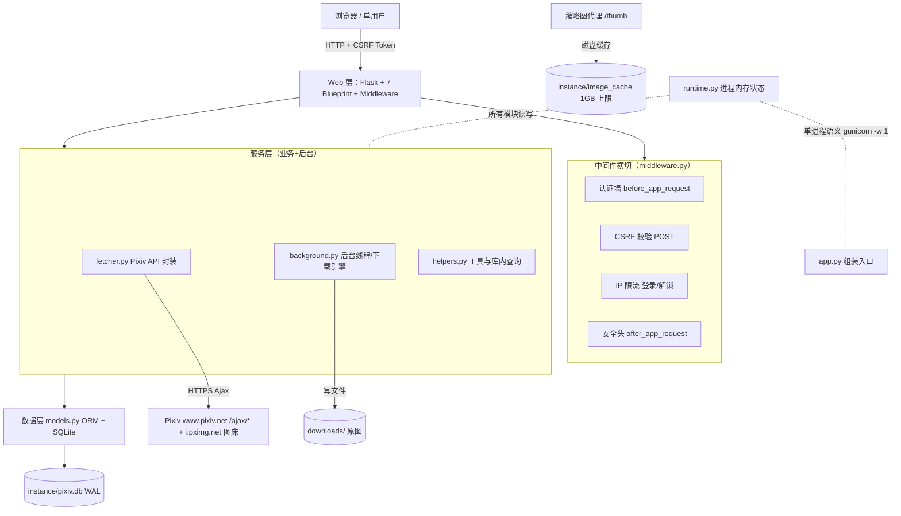
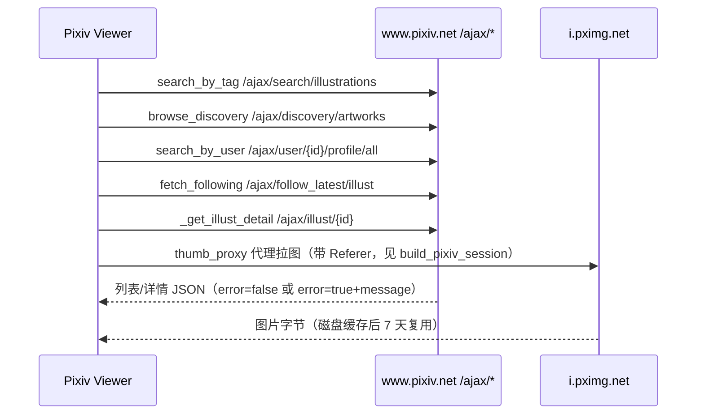
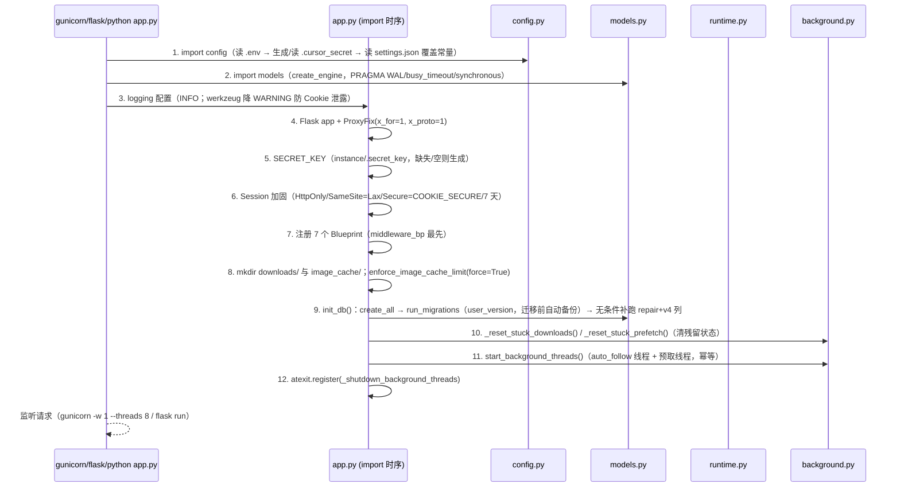
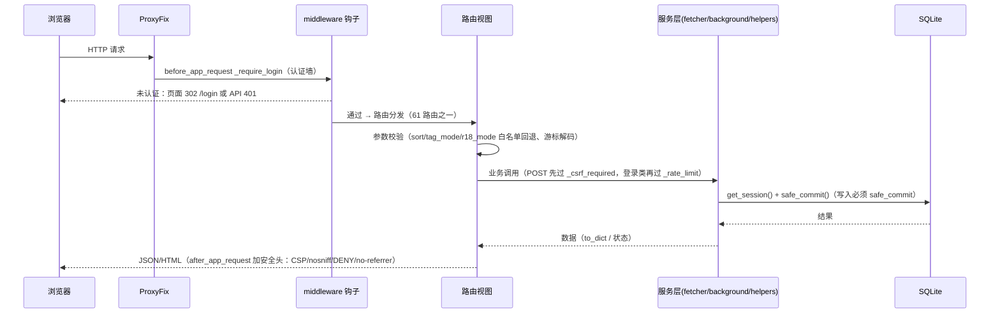
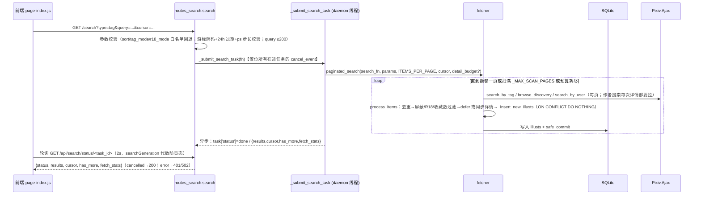
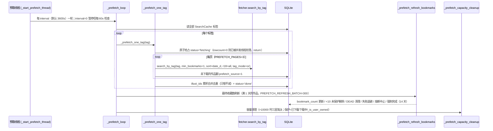
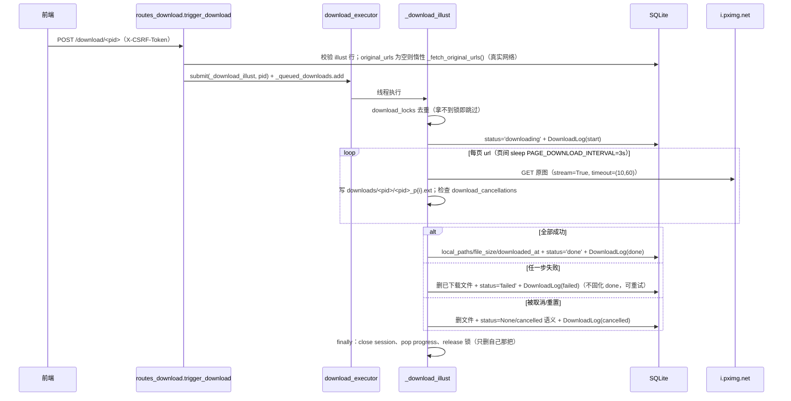
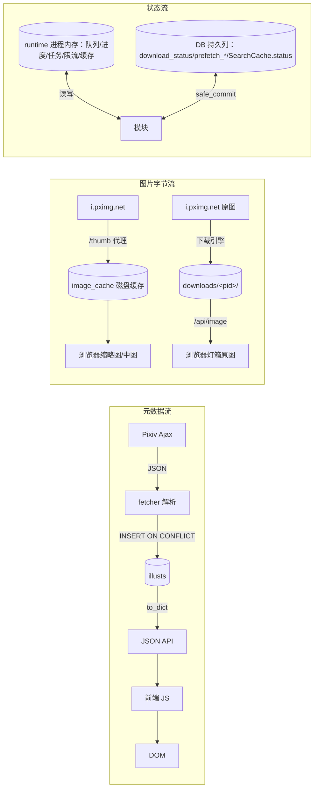

# 项目技术文档 — Pixiv Viewer

> 本文档由对 `E:\pixiv` 仓库全量源码的逆向分析生成（2026-09）。所有技术结论均标注源码位置（`文件::符号名`，行号可经 `grep` 复核）；无法从源码确认的内容明确标注 `未确认` 或 `推测`。
> 符号约定：`文件::符号名` 指该文件内定义的符号；`文件:行号` 为精确位置引用。本仓库无 README，工程级约定以 `AGENTS.md` 为唯一入口文档，本文档与其互补（面向长期维护/交接的完整技术说明），不替代 `docs/architecture.md`（模块地图+测试契约）与 `docs/maintenance.md`（运维手册）。

## 目录

1. [项目概述](#1-项目概述) · 2. [项目目标](#2-项目目标) · 3. [核心功能](#3-核心功能) · 4. [技术栈](#4-技术栈) · 5. [系统架构](#5-系统架构) · 6. [项目目录结构](#6-项目目录结构) · 7. [模块说明](#7-模块说明) · 8. [程序启动流程](#8-程序启动流程) · 9. [核心业务流程](#9-核心业务流程) · 10. [数据流](#10-数据流) · 11. [核心类](#11-核心类) · 12. [核心函数](#12-核心函数) · 13. [API 文档](#13-api-文档) · 14. [数据库设计](#14-数据库设计) · 15. [配置说明](#15-配置说明) · 16. [第三方服务](#16-第三方服务) · 17. [异常处理](#17-异常处理) · 18. [日志系统](#18-日志系统) · 19. [测试体系](#19-测试体系) · 20. [安全分析](#20-安全分析) · 21. [性能分析](#21-性能分析) · 22. [部署说明](#22-部署说明) · 23. [开发环境搭建](#23-开发环境搭建) · 24. [开发指南](#24-开发指南) · 25. [Debug 指南](#25-debug-指南) · 26. [常见问题](#26-常见问题) · 27. [项目优点](#27-项目优点) · 28. [当前问题](#28-当前问题) · 29. [技术债务](#29-技术债务) · 30. [改进建议](#30-改进建议) · 31. [未来演进方向](#31-未来演进方向) · 32. [附录](#32-附录)

---

## 1. 项目概述

| 项 | 内容 |
| --- | --- |
| 项目名称 | Pixiv Viewer |
| 项目类型 | 单人自部署 Flask Web 应用（服务端渲染页面 + JSON API + 后台线程任务） |
| 项目用途 | 通过 Pixiv **内部 Ajax API（非官方接口）** 搜索、浏览、下载 Pixiv 插画；提供本地预取缓存、收藏夹、自动关注与下载管理 |
| 主要解决问题 | ① 不依赖第三方客户端即可在本地网页完成 Pixiv 检索与浏览（隐藏 R18/屏蔽标签）；② 原图批量下载与本地持久化；③ 标签预取构建本地缓存库（离线浏览）；④ 收藏/下载行为完全本地化记录 |
| 使用场景 | 个人自用、本机或内网单实例部署（`AGENTS.md` 明示「单人自部署服务」「不做多实例/多用户扩展」） |
| 运行形态 | 1 个 Flask 进程（生产 gunicorn 单 worker 多线程） + SQLite 数据库 + 磁盘目录（下载/缩略图缓存） |
| 入口 | `app.py` 模块级构造 WSGI 对象 `app`（`app.py:68`），供 `gunicorn app:app` / `flask run` 使用；`python app.py` 走内置开发服务器（`app.py:151-152`） |
| 部署方式 | 源码直部署（git pull + pip 安装 + gunicorn），**无 Docker / CI / 打包配置**（已确认仓库无 Dockerfile、docker-compose、CI 工作流、pyproject.toml、setup.py） |

**关键事实（源码依据）**：

- 所有 Pixiv 请求走非官方 Ajax 端点（`fetcher.py` 内 5 处 `PIXIV_BASE_URL + /ajax/...`），携带 `PHPSESSID` Cookie（`fetcher.build_pixiv_session`，`fetcher.py:290-320`）。
- Cookie 过期时搜索静默返回空、详情返回 `None`（降级不报错），认证类错误显式抛 `PixivAuthError`。
- 该仓库在分析时处于活跃开发状态：`docs/superpowers/` 记录了 2026-07 至 2026-09 的多轮设计-实施-回写过程；200 行级别的模块化重构（2026-08-26 backend-modularization）完成于 `docs/architecture.md` 记录的 commit 序列。

## 2. 项目目标

从源码与工程文档归纳（`AGENTS.md` 开场段、`docs/maintenance.md`、`docs/superpowers/specs/*`）：

1. **替代网页端进行插画检索**：标签/作者/发现页三类搜索，支持收藏数下限、R18、屏蔽标签过滤，异步执行不阻塞页面。
2. **本地原图下载**：单/批量下载、进度展示、取消/重置、ZIP 打包导出，全部行为写入 `download_logs` 审计。
3. **标签预取构建离线缓存**：设置页配置标签，后台按周期抓取元数据入库（上限 10000 条），独立缓存浏览页 `/cache` 支持库内过滤/排序/分页；`/search` 本身永远走实时 Pixiv（`routes_search.py` 缓存浏览与实时搜索分离是有意设计，见 `docs/superpowers/specs/2026-08-13-cache-browse-page-design.md`）。
4. **低限流风险的稳健抓取**：三级令牌桶、分类重试、并发上限、失败冷却，目标是「长期运行不触发 Pixiv 403」。
5. **单机可维护**：SQLite 单文件 + 启动自动迁移（迁移前自动备份）+ 两类磁盘缓存均带容量上限自动淘汰。
6. **公网可加锁**：可选全局访问密码（`ACCESS_PASSWORD`）登录墙 + CSRF + 安全头（`docs/superpowers/specs/2026-07-25-security-robustness-fixes-design.md` 落地）。

## 3. 核心功能

| 功能 | 说明 | 主要源码 |
| --- | --- | --- |
| 搜索（标签 / 作者 / 发现） | `GET /search` 异步提交任务返回 `task_id`，后台线程抓取，前端轮询状态；支持游标翻页（HMAC 签名、24h 过期）、收藏数下限、R18 三元过滤、屏蔽标签 | `routes_search.py::search` / `fetcher.py::paginated_search` / `search_by_tag` / `search_by_user` / `browse_discovery` |
| 异步搜索任务管理 | 提交新搜索即取消在途任务；任务 TTL 600s 自动清理；终态 done/error/cancelled | `routes_search.py::_submit_search_task` / `_cleanup_search_tasks` |
| 图库 | 已下载作品浏览：本地目录扫描 + DB 过滤（屏蔽/R18/收藏数/标签），孤儿文件（无 DB 记录）补全展示，收藏状态标注，分页 | `routes_gallery.py::api_gallery` |
| 详情页 | 作品信息、中图/原图代理链接、相关作品（同画师已下载）、连续翻页（前端） | `routes_gallery.py::detail_page` |
| 图片服务 | `/thumb/<b64>` 缩略图代理（白名单 + 磁盘缓存 7 天 + 1GB 上限淘汰）；`/api/image/<pid>/<index>` 本地已下载原图发送（ETag 7 天） | `routes_gallery.py::thumb_proxy` / `serve_image` |
| 下载引擎 | 后台线程池（默认 2 worker）下载原图；锁去重、逐页间隔、取消/重置、失败删除部分文件、审计日志 | `background.py::_download_illust` |
| 文件导出 | 单文件直发，多文件 ZIP（ZIP_STORED 内存缓冲） | `routes_download.py::download_file` |
| 收藏夹 | 多收藏夹 CRUD；`position` 分数差值排序 + 上移/下移（乐观锁）；「我的收藏」为收藏语义唯一来源 | `routes_collections.py` / `models.py::Collection,CollectionItem` / `helpers.py::_compute_move_position` |
| 标签预取 | 后台循环按周期抓取配置标签；`prefetch_source` 标记；最终收藏数刷新状态机（背压/退避/熔断/强制完成） | `background.py::_prefetch_loop` / `_prefetch_refresh_bookmarks` / `_prefetch_capacity_cleanup` |
| 缓存浏览页 | `/cache` 页 + `/api/cache/*`：库内过滤/排序/分页，不请求 Pixiv | `routes_search.py::cache_items` / `helpers.py::query_cached_tag` |
| 自动关注 | 后台按间隔拉取关注画师最新作品，可选自动下载 | `background.py::_auto_follow_worker` |
| 屏蔽标签 / R18 过滤 | `blocked_tags` 表 + 搜索/图库/缓存三处统一过滤 | `routes_settings.py` / `fetcher.py::_get_blocked_tags` |
| 认证与设置 | 全局访问密码登录墙（可选）、设置页（settings.json 读写）、旧 SETTINGS_PASSWORD 门禁兼容 | `middleware.py` / `routes_settings.py` |
| 安全加固 | CSRF 全覆盖、IP 限流（登录/解锁）、CSP 等安全头、防开放重定向、游标签名 | `middleware.py` / `fetcher.py::encode_cursor` |

## 4. 技术栈

| 类别 | 选型 | 版本（lock 文件实测） | 说明 |
| --- | --- | --- | --- |
| 语言 | Python | 3.13（venv 实测，`requirements-lock.txt` 配套）；语法下限 3.9+（全模块 `from __future__ import annotations`） | 无类型检查 |
| Web 框架 | Flask | 3.1.3 | 传统多页 + Blueprint 路由（7 个） |
| ORM | SQLAlchemy 2.0 | 2.0.51 | Declarative 映射，原生 SQL（`text()`）用于性能热点 |
| 数据库 | SQLite | 3.50.4（实测） | WAL 模式、`busy_timeout=10000`、`synchronous=NORMAL`（`models.py:23-29`） |
| HTTP 客户端 | requests | 2.34.2 | 带 urllib3 `Retry(total=1, connect=0)`（`fetcher.py:312-319`） |
| WSGI 服务器 | gunicorn | 26.0.0 | 生产（Linux）；**必须 `-w 1`** |
| 模板 | Jinja2 | 3.1.6 | 8 个模板 |
| 前端 | 原生 JS（ES2020 上限）+ Bootstrap | 5.3.3（本地 vendor，无 CDN） | **无构建步骤**，浏览器直接加载源文件；CSP `script-src 'self'` 禁内联脚本 |
| 测试 | pytest | 9.1.1 | 313 用例（实测），无集成测试用例 |
| 部署 | systemd + gunicorn（Linux） | — | 仅文档示例（`docs/maintenance.md:118-135`），仓库无 unit 文件 |

## 5. 系统架构

### 5.1 总体分层



要点：

- **分层**：Web/路由层（`routes_*`，61 路由）→ 服务层（fetcher/background/helpers）→ 数据层（`models.py`）；中间件横切于请求前后；`runtime.py` 提供全部进程级共享状态。
- **依赖单向无环**：`config/runtime/helpers(叶子) → middleware → background → routes_* → app.py`（`docs/architecture.md:25-37` 与源码 import 一致）。`routes_*` 之间互不导入；`middleware`/`background`/`routes_*` 内对「可能被测试补丁的符号」一律在**函数体内 `import app` 延迟引用**（测试契约，见 §24.4）。
- **部署拓扑约束**：进程内存状态（下载队列/搜索任务/限流/预取/关注状态）**不支持多 worker**（`runtime.py:30-42`），生产必须 `gunicorn -w 1 --threads 8`（线程共享进程内存，提供并发）。

### 5.2 线程模型

| 线程 | 来源 | 用途 | 生命周期 |
| --- | --- | --- | --- |
| gunicorn worker 主线程 + 线程池（`--threads 8`） | gunicorn | 服务 HTTP 请求 | 进程生命周期 |
| `_auto_follow_thread` | `background.start_background_threads`（`background.py:724-731`，daemon） | 自动关注轮询 | 进程生命周期，`_auto_follow_stop` Event 停止 |
| 预取线程 | `_start_prefetch_thread`（`background.py:570-590`，daemon） | 预取循环（首轮延迟 5s，按 interval） | 进程生命周期 |
| `download_executor` 线程池 | `runtime.py:65`（`ThreadPoolExecutor(max_workers=DOWNLOAD_MAX_WORKERS)`） | 下载任务执行 | 进程生命周期 |
| 每个搜索任务一个 daemon 线程 | `routes_search._submit_search_task`（`routes_search.py:110`） | 异步搜索 | 任务生命周期 |
| 后台详情补全 daemon 线程 | `fetcher._kick_background_fill`（`fetcher.py:727-732`） | defer 路径补拉详情 | 每次调用起一个 |
| 手动刷新标签 daemon 线程 | `routes_prefetch.prefetch_refresh_post`（`routes_prefetch.py:211`） | 单标签预取 | 任务生命周期 |

共享可变容器的线程安全约定：遍历清理与「读→判→写」必须整体持锁（`_rate_limit_lock`、`_thumb_failed_lock`、`_search_tasks_lock`、`_download_locks_guard`）；TTL 缓存「先写数据再写时间戳」；释放锁只删自己那份（`background._release_download_lock`，`background.py:603-608`）。已知可接受的不加锁项：`fetcher._last_fetch_stats`（仅影响展示统计）、`_scan_cache`/`_db_pids_cache`（重复扫描优于脏数据）。

### 5.3 外部系统交互



无其他第三方服务、无消息队列、无外部缓存中间件（缓存均为进程内存 / SQLite / 本地文件自实现）。

## 6. 项目目录结构

```text
E:\pixiv\
├── AGENTS.md                      # 唯一工程入口文档（命令/架构/约定/测试契约/并发约定/性能基线）
├── app.py                         # 组装入口（152 行）：Flask app、ProxyFix、SECRET_KEY、Session 加固、
│                                  #   注册 7 Blueprint、启动后台线程、4 个页面路由；app 命名空间补丁契约
├── config.py                      # 常量 + .env（setdefault 手写解析）+ instance/settings.json import 时覆盖；
│                                  #   SETTINGS_KEYS 是设置键唯一来源
├── models.py                      # SQLAlchemy ORM（6 表）+ init_db / get_session / safe_commit / get_favorite_pids
├── runtime.py                     # 进程内存状态（-w 1 语义）：扫描缓存/限流存储/搜索任务/下载队列/预取状态
├── helpers.py                     # 纯工具与库内查询：缓存淘汰、下载目录扫描、URL 工具、query_cached_tag、收藏位置
├── middleware.py                  # 认证 / CSRF / 限流 / 安全头；app 级钩子随 middleware_bp 全局生效
├── background.py                  # 后台线程与下载引擎：自动关注、预取（含最终收藏数刷新状态机）、下载执行器、启动重置
├── fetcher.py                     # Pixiv API 封装（1373 行）：认证、搜索、详情、令牌桶、重试策略、预算、取消、入库
├── routes_search.py               # /search（异步任务）、/api/search/status、/api/cache/*、/api/following
├── routes_gallery.py              # /gallery、/detail、/api/gallery*、/thumb、/api/image、/api/favorite、/api/open-dir
├── routes_download.py             # /download 系列、/api/downloads、/download_file、下载管理页
├── routes_prefetch.py             # /api/prefetch/{config,tags,status,refresh,refresh-reset}
├── routes_collections.py          # /api/collections 全部（items/batch/move）
├── routes_settings.py             # /login、/settings、/api/settings、/api/blocked-tags、/api/auto-follow/*
├── migrations/
│   ├── __init__.py                # 导出 MIGRATIONS / LATEST_SCHEMA_VERSION / run_migrations
│   ├── runner.py                  # PRAGMA user_version 版本化迁移 + 迁移前自动备份（backup_database）
│   └── versions.py                # v1-v4 迁移实现（含 SQLite<3.35 重建表兼容策略）
├── scripts/
│   ├── run_tests.ps1              # pytest 包装：确定性临时根 + 沙箱 shim 条件加载 + 直调 venv python
│   ├── sandbox_pytest_shim.py     # DSH 沙箱专用插件：剥 os.mkdir 的 mode（0o700 → ACL 问题）
│   ├── pixiv-cleanup.sh           # 仅清理已下载原图（30 天前 + 收藏 <100），realpath 越界保护
│   └── _inspect_db.py             # 巡检：打印表名与六表行数
├── tests/                         # conftest + 12 个 pytest 文件 + test_cleanup_script.ps1（约 313 用例）
├── templates/                     # 8 个 Jinja2 模板（index/gallery/detail/downloads/cache/settings/settings_unlock/login）
├── static/
│   ├── app.js                     # 共享工具（$ / escHtml / proxyThumb / fmtSize / pvCache / showToast ...）
│   ├── page-*.js                  # page-index/gallery/detail/downloads/cache/settings/login/settings_unlock（按页入口）
│   ├── lightbox.js                # 灯箱（扁平图片级导航 + /api/detail 探测）
│   ├── style.css                  # 粉色系设计令牌、响应式、prefers-reduced-motion 降级
│   └── vendor/bootstrap-5.3.3/    # 本地 vendor（bootstrap.min.css / bootstrap.bundle.min.js）
├── docs/
│   ├── architecture.md            # 模块地图 + -w 1 语义 + app 命名空间测试补丁契约（改动前必读）
│   ├── maintenance.md             # 运维手册（存储分类 / 备份回退 / gunicorn 部署 / 清理脚本）
│   └── superpowers/{specs,plans}/ # 22 份设计文档（spec 11 + plan 11，见 §32.4）
├── requirements.txt               # 4 个直接依赖（区间约束）
├── requirements-dev.txt           # + pytest
├── requirements-lock.txt          # 22 项精确 pin（可复现部署）
├── pytest.ini                     # testpaths=tests / addopts=-ra / marker: integration
├── .gitignore                     # venv/ instance/ downloads/ cookies.txt .env .pytest-*/ .workbuddy/ 等
├── instance/                      # 运行数据（gitignore）：pixiv.db(+WAL/SHM)、settings.json、
│                                  #   .secret_key、.cursor_secret、backups/、image_cache/
├── downloads/                     # 已下载原图（gitignore），目录名 = pixiv_id
├── cookies.txt                    # Pixiv 会话（gitignore，敏感文件）
├── opendesign/                    # 设计工作流产物（design-systems + mockups，不参与运行）
├── pixiv-api-http-main/           # 内置第三方 Node.js Pixiv API 参考实现（仅接口对照，不参与运行）
├── PpPpP的收藏夹方案.md            # 收藏夹设计文档（项目 v1 迁移采纳其分数差值排序思想）
└── 0001-fix-reset-stuck-prefetch-*.patch  # 外部补丁（引入 _reset_stuck_prefetch，已并入启动序列）
```

分类：**核心代码**＝根目录 15 个 Python 模块 + templates/ + static/；**基础设施**＝migrations/ + scripts/；**配置**＝config.py + 3 个 requirements + pytest.ini + .gitignore；**测试**＝tests/；**工具**＝scripts/_inspect_db.py、scripts/pixiv-cleanup.sh；**入口**＝app.py（`app:app`）；**参考/可选**＝opendesign/、pixiv-api-http-main/、*.patch、方案文档；**运行数据**＝instance/、downloads/、cookies.txt（全部 gitignore）。

## 7. 模块说明

### 7.1 模块职责总表

| 模块 | 职责一句话 | 关键符号 | 依赖 |
| --- | --- | --- | --- |
| `app.py` | 组装入口：Flask app / 配置 / 注册 7 Blueprint / 后台线程 / 4 页面路由；app 命名空间测试补丁契约 | `app`、`index`、`csrf_token`、`cache_page`、`favicon` | 全部模块（from-import 再导出） |
| `config.py` | 常量、`.env` 解析、`settings.json` import 时覆盖；`SETTINGS_KEYS` 设置键唯一来源 | `SETTINGS_KEYS`（config.py:133-150）、`COOKIE_PATH`、`PREFETCH_*`、`ACCESS_PASSWORD`、`SETTINGS_PASSWORD`、`COOKIE_SECURE` | 标准库、无模块依赖 |
| `models.py` | ORM 6 表 + 会话管理 + 迁移入口 | `Illust`/`BlockedTag`/`DownloadLog`/`SearchCache`/`Collection`/`CollectionItem`、`init_db`、`get_session`、`safe_commit`、`get_favorite_pids` | config、sqlalchemy |
| `runtime.py` | 进程内存状态（-w 1 语义） | `_scan_cache`、`_db_pids_cache`、`_prefetch_state`、`download_executor`、`download_cancellations`、`_queued_downloads`、`_download_progress`、`_rate_limit_store`、`_search_tasks`、`SEARCH_TASK_TTL` | config、标准库 |
| `helpers.py` | 纯工具函数与库内查询 | `enforce_image_cache_limit`、`_scan_local_downloads`、`_build_orphan_dicts`、`query_cached_tag`、`_pid_filter`、`_next_collection_position`、`_compute_move_position`、`_delete_illust_files`、`_delete_orphan_files` | config、models、fetcher、runtime |
| `middleware.py` | 认证墙 / CSRF / IP 限流 / 安全头（app 级钩子） | `_require_login`、`_csrf_required`、`_rate_limit`、`_check_rate_limit`、`_get_csrf_token`、`_get_json_body`、`_safe_next`、`_security_headers`、`bp` | runtime |
| `background.py` | 后台线程与下载引擎 | `_auto_follow_worker`、`_prefetch_loop`、`_prefetch_one_tag`、`_prefetch_refresh_bookmarks`、`_refresh_bookmarks_pass`、`_prefetch_capacity_cleanup`、`reset_prefetch_refresh`、`_download_illust`、`_reset_stuck_downloads`、`_reset_stuck_prefetch`、`start_background_threads`、`_is_user_owned` | fetcher、helpers、runtime、models |
| `fetcher.py` | Pixiv API 封装（认证/搜索/详情/限流/重试/预算/取消/入库/连接池） | `build_pixiv_session`、`get_pooled_session`、`reset_pooled_session`、`paginated_search`、`search_by_tag`、`search_by_user`、`browse_discovery`、`fetch_following`、`_get_illust_detail`、`_fetch_details_parallel`、`_process_items`、`_insert_new_illusts`、`encode_cursor`/`decode_cursor`、`_TokenBucket`、`PixivAuthError`、`SearchCancelledError`、`DEAD_DETAIL`、`RETRYABLE_GLOBAL_DETAIL` | config、models |
| `routes_search.py` | 搜索任务 / 状态轮询 / 缓存浏览 / following | `search`、`search_status`、`cache_items`、`api_cache_tags`、`cache_item_delete`、`api_following`、`_submit_search_task`、`_cleanup_search_tasks` | middleware、helpers、fetcher、background、models、runtime |
| `routes_gallery.py` | 图库 / 详情 / 图片服务 / 缩略图代理 / 收藏/打开目录 | `thumb_proxy`、`serve_image`、`detail_page`、`detail_api`、`api_gallery`、`delete_gallery`、`batch_delete_gallery`、`api_favorite_*`、`api_open_dir`、`CACHE_DIR`（单点定义） | helpers、fetcher、middleware、models、runtime |
| `routes_download.py` | 下载触发/状态/取消/批量/导出/管理页 | `trigger_download`、`batch_download`、`_cancel_download_internal`、`download_status`、`download_status_batch`、`download_file`、`api_downloads` | background、helpers、middleware、models、runtime |
| `routes_prefetch.py` | 预取管理 API | `prefetch_config_get/post`、`prefetch_tags_get/post/delete`、`prefetch_status_get`、`prefetch_refresh_reset_post`、`prefetch_refresh_post`、`_PREFETCH_SETTINGS_KEYS` | background、fetcher、middleware、models、runtime |
| `routes_collections.py` | 收藏夹全部路由 | `list_collections`、`create_collection`、`update_collection`、`delete_collection`、`list_collection_items`、`add_collection_item`、`remove_collection_item`、`batch_add/remove_collection_items`、`move_collection_item` | helpers、middleware、models |
| `routes_settings.py` | 登录 / 设置 / 屏蔽标签 / 自动关注控制 | `login_page`、`login_submit`、`settings_page`、`api_settings_get/post`、`settings_unlock`、`list/add/remove_blocked_tag`、`auto_follow_status/config`、`_SETTINGS_PATH`、`_load_settings`、`_settings_locked` | middleware、fetcher、models、runtime |

### 7.2 模块依赖关系

```text
config / runtime / models（叶子）
    ↑
fetcher ──→ config, models
helpers ──→ config, models, fetcher, runtime
middleware ──→ runtime；函数体内 import app（认证位）
background ──→ fetcher, helpers, runtime, models
routes_search / routes_gallery / routes_download / routes_prefetch / routes_collections / routes_settings
    ──→ middleware, helpers, runtime, background, models（模块间互不 import）
app.py（最后组装，from-import 再导出 20+ 符号作为测试补丁 seam）
```

依赖存在的原因：fetcher 收敛全部上游 HTTP 与限流/重试/入库策略（单一事实来源）；background 作为唯一的后台任务与下载引擎所有者；routes_* 只做参数校验、编排与响应组装；所有模块共享 `runtime` 的进程内存状态与 `models` 的会话/提交规范（必须 `safe_commit()`）。

### 7.3 输入 / 输出 / 边界（代表性模块）

- **fetcher**：输入＝搜索参数/作品 id/Cookie 文件（`cookies.txt`）；输出＝作品 dict 列表（写入 `illusts` 行并返回 `to_dict()` 结果）、`None`/哨兵（失败语义）；边界＝三级令牌桶（45/20/60 每分钟）+ urllib3 传输层重试 1 次 + 应用层分类重试。
- **background**：输入＝`runtime` 状态与 DB（`SearchCache` 标签、`Illust` 行）；输出＝入库/标记/文件系统副作用；边界＝`_is_user_owned` 保护判定、启动重置、interval=0 暂停。
- **routes_***：输入＝HTTP 参数（白名单枚举校验）；输出＝JSON/HTML；边界＝CSRF/认证/限流 装饰器。

## 8. 程序启动流程

### 8.1 启动调用链（源码级，`app.py` 全模块顺序）



### 8.2 请求生命周期



### 8.3 加载顺序与配置

- 依赖单向：`config / runtime / helpers（叶子）→ middleware → background → routes_* → app.py`，无循环 import（`docs/architecture.md:25-37`）。
- 配置三层：环境变量（`os.environ.setdefault`，`.env` 手写解析，config.py:22-34）＜ 常量默认值 ＜ `instance/settings.json` import 时覆盖（config.py:152-167）。**settings.json 修改需重启进程生效**，例外：`prefetch_interval` 等预取三键经 `/api/prefetch/config` 或设置页保存后立即同步内存。
- 测试隔离：`tests/conftest.py` 在 import `models`/`app` **之前**覆盖 `config.DATABASE_PATH` 为临时文件并关闭后台间隔（AUTO_FOLLOW_INTERVAL=0 / PREFETCH_INTERVAL=0），否则会连生产库（conftest.py:8-15，历史事故 P0-1）。

---

## 9. 核心业务流程

### 9.1 搜索（异步任务）



要点（源码）：
- 参数：`type`(tag|user)、`query`、`min_bookmarks`、`sort`(popular_d|date_d)、`tag_mode`(or|and)、`r18_mode`(all|safe)、`cursor`（`routes_search.py:119-140`）。`popular_d` 需 Pixiv Premium，非 Premium 静默空结果。
- **提交即取消在途任务**（`routes_search.py:51-56`）：旧的抢令牌桶会拖慢新搜索。
- 作者搜索是唯一「必须拉详情才能过滤」的路径：`detail_budget=ITEMS_PER_PAGE×2`（`routes_search.py:210`、`fetcher.py:89`），预算存 `threading.local`（`fetcher._detail_budget`），耗尽即停翻页；残缺结果不写缓存（`fetcher.py:1262-1263`）。
- 取消检查点：翻页前后 + `_fetch_details_parallel` 每个 worker 发请求前（`fetcher.py:180-209`、`636-661`）；在途请求照常处理完并入库（下次命中 existing_map 免重拉）。
- 空查询回退 `browse_discovery()`（`routes_search.py:180-186`）。

### 9.2 标签预取循环（后台）



要点（源码）：
- 入库永不停，容量靠三层淘汰压住（`background.py:554-561` 注释明确否决「暂停入库」方案）。
- 刷新失败状态机（`background._refresh_bookmarks_pass`，`background.py:282-421`）：暂时性失败写 `refresh_failed_at` 退避 24h；404/删除类返回 `DEAD_DETAIL` 当场删除（已下载/已收藏保留并标记完成）；限流/连接错误返回 `RETRYABLE_GLOBAL_DETAIL` 不写标记，连续 3 条熔断本轮；认证失效/缺 Cookie 只中止不冒泡（冒泡会跳过容量清理、上限失效）。
- 容量清理三层（`background._prefetch_capacity_cleanup`，`background.py:470-535`）：① 已最终刷新（信号可信）② 未刷新但失败过或入库 >3 天③ 其余未刷新兜底；层内收藏数低优先、并列更早上传优先；保护判定统一 `_is_user_owned`（`background.py:241-253`：收藏夹成员或用户操作类 DownloadLog，`prefetch_deleted` 不算保护）。
- 手动干预：`POST /api/prefetch/refresh`（单标签后台刷新）、`POST /api/prefetch/refresh-reset`（`{tag}` 或 `{pixiv_id}`，清标记放回队列）。

### 9.3 下载



要点（源码）：
- 无 `original_urls` 时不固化 `done`，而是置空以便重试（`background.py:635-643`）。
- 取消分两个入口：`/download/cancel`（标记取消，worker 自行感知清理）与 `/download/reset`（立即删残留文件 + 重置状态；取消标记留给 worker 的 finally 清理，`routes_download.py:79-112`）。
- 自动关注新作品先 commit 再提交下载，否则 `_download_illust` 查不到行会静默跳过（`background.py:127-135`）。

### 9.4 收藏与移动排序

- 收藏语义完全由 Collection 驱动：切换收藏 = 在「我的收藏」收藏夹增删 `CollectionItem`（`routes_gallery.py:551-576`）；判断收藏用 `models.get_favorite_pids()`；`Illust.is_favorite` 列已废弃删除（v2 迁移）。
- 排序：新项位置 = 当前最大 position + 1000（`helpers._next_collection_position`）；上移/下移在相邻项之间取中点（间距 <1.0 时触发全量重排 `(i+1)*1000`）；最终 UPDATE 带 `AND position=:op` 乐观锁，rowcount=0 返回 409（`routes_collections.py:193-248`）。

### 9.5 缩略图代理

```text
GET /thumb/<urlsafe_b64(url)>
  → 白名单校验：仅 https://i.pximg.net/ 前缀，否则 403；解码失败 400
  → 磁盘缓存命中（md5(url).<ext> + .meta 存 mimetype）→ send_file(max_age=7天)
  → 未命中：冷却检查（失败 URL 30s 内直接 502）→ _thumb_sem(12) 并发闸
         → get_pooled_session() 拉取；连接类异常重建连接池快失败重试一次（超时不重试）
         → 成功：临时文件原子写（tmp+rename）+ .meta + enforce_image_cache_limit(节流)
         → 失败：记 _thumb_failed（带锁）+ 清理过期记录 → 502
  文件：routes_gallery.py::thumb_proxy（42-122）
```

---

## 10. 数据流



要点：
- `Illust.to_dict()` 不输出 `local_paths`（磁盘绝对路径不外泄），前端取图一律走 `/api/image/<pid>/<index>`（`models.py:124-144` 注释）。
- `tags`/`original_urls`/`local_paths` 为 JSON 文本列，读写走 `*_list` property（`models.py:86-122`）；库内过滤用 SQLite `json_each()`（`helpers._pid_filter`、`query_cached_tag`、`routes_gallery.api_gallery`），单条损坏 JSON 抛 `OperationalError` 时按「降级跳过标签过滤」兜底（`helpers.py:265-273`、`routes_gallery.py:359-365`）。
- 搜索任务状态流：task dict 在进程内存；前端轮询时顺带清理过期任务（`routes_search._cleanup_search_tasks`，TTL 600s）。

---

## 11. 核心类

### 11.1 ORM 模型（`models.py`）

| 类 | 表 | 职责 | 关键字段（类型） | 关键方法/属性 |
| --- | --- | --- | --- | --- |
| `Illust` | `illusts` | 作品元数据（搜索/预取/下载共用一张表） | `pixiv_id`(int, UNIQUE, index)、`title`、`user_id`(index)、`user_name`、`tags`(Text JSON)、`page_count`、`bookmark_count`、`bookmark_updated_at`(DateTime?)、`upload_date`、`thumb_url`、`original_urls`(Text JSON)、`local_paths`(Text JSON, null)、`download_status`(String?)、`downloaded_at`、`file_size`、`prefetch_source`(int 0/1)、`prefetch_refresh_at`(DateTime?)、`refresh_failed_at`(DateTime?)、`created_at` | `tags_list`/`original_urls_list`/`local_paths_list`（JSON property，坏 JSON 返回 []/None）、`to_dict(favorite)`（不输出 local_paths） |
| `BlockedTag` | `blocked_tags` | 屏蔽标签 | `tag`(String, UNIQUE, index)、`created_at` | — |
| `DownloadLog` | `download_logs` | 下载/删除审计 | `pixiv_id`(int, index)、`action`(String)、`message`、`created_at` | `to_dict()` |
| `SearchCache` | `search_cache` | 预取缓存索引（tag 主键） | `tag`(String, PK)、`illust_ids`(Text JSON)、`cached_at`(DateTime?)、`status`(String: idle/fetching/done/error)、`error`、`total`(int) | — |
| `Collection` | `collections` | 收藏夹 | `name`(String, UNIQUE)、`description`、`created_at`、`updated_at`(onupdate) | `to_dict()` |
| `CollectionItem` | `collection_items` | 收藏夹条目（UNIQUE(collection_id,pixiv_id)） | `collection_id`(FK→collections.id)、`pixiv_id`(int, index)、`position`(Float，分数差值排序)、`created_at` | `to_dict()` |

模块级函数：`init_db()`（create_all→迁移→兜底 repair，models.py:234-245）、`get_session()`（`Session(engine)`）、`safe_commit(session)`（失败 rollback 后原样抛出，models.py:32-49）、`get_favorite_pids(session)`（「我的收藏」成员集合，models.py:252-258）。

### 11.2 异常/哨兵类（`fetcher.py`）

| 类/哨兵 | 类型 | 语义 |
| --- | --- | --- |
| `PixivAuthError`（fetcher.py:39-40） | Exception | Cookie 失效/401/认证措辞报错 → 路由层 401 或任务终态 error(auth)；预取刷新只中止本轮 |
| `SearchCancelledError`（fetcher.py:126-127） | Exception | 搜索被新搜索取消，调用链据此中止（task 终态 cancelled，返回 200） |
| `DEAD_DETAIL`（fetcher.py:492） | object 哨兵 | 详情永久死亡（404/删除类报错），重试无意义（仅 `return_dead=True` 时返回） |
| `RETRYABLE_GLOBAL_DETAIL`（fetcher.py:498） | object 哨兵 | 全局性暂时失败（403/429 耗尽、连接错误），刷新侧据此熔断本轮 |
| `_CANCELLED_FETCH`（fetcher.py:149） | object 哨兵 | 并行详情 worker 未发起请求即被取消 |
| `_TokenBucket`（fetcher.py:458-476） | 类 | 全局请求限速（`wait()` 持锁 sleep，保证任意时刻全局间隔 ≥ 60/rate 秒）；实例 `_detail_limiter`(45)/`_fill_limiter`(20)/`_total_limiter`(60) |

### 11.3 其他重要类/机制

- `middleware.bp`（Blueprint 无路由，仅挂 app 级钩子）+ 装饰器工厂 `_rate_limit(max_attempts, window)`。
- `fetcher` 线程本地连接池：`_thread_local`（`threading.local`）承载 session 与 Cookie 文件 mtime 戳；`get_pooled_session()` 按线程复用、`reset_pooled_session()` 丢弃重建（`fetcher.py:332-371`）。
- 前端类（ES2020，无 class 私有字段）：`pvCache`（localStorage TTL 缓存对象，`static/app.js:44`）；灯箱、导航等为工厂函数 + DOM 操作（详见 §13 前端约定）。

---

## 12. 核心函数

### 12.1 `fetcher.py`

| 函数 | 签名要点 | 作用 | 调用者 → 被调用 |
| --- | --- | --- | --- |
| `build_pixiv_session()` | `() -> requests.Session` | 构造带 UA/Referer/Cookie/代理/SSL/Retry(total=1,connect=0) 的 session；**所有 Pixiv 请求必须经此工厂** | 搜索/详情/下载/补全；每次新建（连接池销毁） |
| `get_pooled_session()` / `reset_pooled_session()` | — | 线程内连接池复用，Cookie mtime 变化自动重建 | `/thumb`、`_fetch_details_parallel` 热点路径 |
| `paginated_search(search_fn, query_params, items_per_page, cursor_data, *, detail_budget=0)` | 返回 (batch, next_cursor, has_more) | 游标驱动分页；翻页前后取消检查；预算检查；失败页结束分页 | `routes_search._fn`（3 类搜索共用） |
| `search_by_tag(keyword, min_bookmarks, page, sort_order, max_pages, tag_mode, r18_mode, defer_details, max_results, limiter)` | (results, has_more) | 标签搜索；`defer = defer_details or min_bookmarks==0` 默认不拉详情（列表自带 tags/thumb）；结果缓存 30s（键含全部参数） | `routes_search`、`background._prefetch_one_tag` |
| `search_by_user(user_id, min_bookmarks, page, hide_r18, max_results, limiter)` | (results, has_more) | 作者搜索：profile/all 只给 id，必须全量同步详情过滤；**切片用 ITEMS_PER_PAGE(24)**；独立缓存 600s 且键含 `_blocked_fingerprint(blocked)` | `routes_search` |
| `browse_discovery(page, sort_order, min_bookmarks, r18_mode, ...)` | (results, has_more) | 发现页（空查询回退） | `routes_search` |
| `fetch_following(page, r18_mode)` | (results, has_more) | 关注最新作品；本地方再兜一层 R18 过滤 | `background._auto_follow_worker`、`routes_search.api_following` |
| `_get_illust_detail(session, pixiv_id, limiter, return_dead=False)` | dict / None / 哨兵 | 详情拉取 + 分类重试（ConnectionError 立即返回；403/429 退避 3s/9s；其他退避 1s；401→PixivAuthError；404/删除关键词→DEAD_DETAIL） | `_fetch_details_parallel`、`helpers._fetch_original_urls`、`background._refresh_bookmarks_pass` |
| `_fetch_details_parallel(pixiv_ids, early_stop, limiter)` | (results: dict, attempted: int) | 并行详情 + early_stop 流式过滤 + 取消；已启动请求处理完再返回（防分页漂移重复） | `_process_items`、`_background_fill_details` |
| `_process_items(db, items, id_extractor, illust_factory, blocked, *, min_bookmarks, hide_r18, defer_details, max_results, limiter)` | list[dict] | 去重→过滤→（defer 写库/同步拉详情）→入库→收藏标注；`_budget_consume(attempted)` | 3 个搜索函数 |
| `_insert_new_illusts(db, illusts)` | `{pid: 赢家行}` | `INSERT ... ON CONFLICT DO NOTHING` 冲突容忍批量写 + 按 pid 回查 | `_process_items` |
| `_background_fill_details(pixiv_ids)` / `_kick_background_fill(pixiv_ids)` | — | 后台补全 bookmark_count/original_urls（低速桶 20/min、作品级 300s 去重） | `_process_items`（defer 路径）、`routes_gallery.api_gallery` |
| `encode_cursor(data)` / `decode_cursor(cursor)` | str / dict\|None | HMAC-SHA256 签名游标（`CURSOR_SECRET`），校验失败返回 None | `paginated_search` / `routes_search.search` |
| `_TokenBucket.wait()` | — | 全局请求间隔 | 详情/profile 请求 |
| `_get_user_profile_ids(session, user_id)` | list[int] | profile/all 拉作者全部作品 id，缓存 600s/64 条 | `search_by_user` |

### 12.2 `background.py`

| 函数 | 作用 | 调用链 |
| --- | --- | --- |
| `_reset_stuck_downloads()` | 启动时清「downloading」残留：删目录文件 + 状态置 None + DownloadLog(failed) | app.py import 时序 |
| `_reset_stuck_prefetch()` | 启动时把 `SearchCache.status='fetching'` 重置为 done（否则标签被永久跳过） | app.py import 时序 |
| `_auto_follow_worker()` | 轮询关注列表（≤10 页、页间 sleep 1s）→ 去重 → 新作品入库 → 可选自动下载 | `start_background_threads` |
| `_prefetch_one_tag(tag)` | 单标签预取：原子抢占 fetching → 每页 search_by_tag → 翻转 prefetch_source → illust_ids 累积合并 | `_prefetch_loop`、`routes_prefetch.prefetch_refresh_post` |
| `_prefetch_loop()` | 一轮预取：遍历标签 → 刷新最终收藏数 → 容量清理 → 更新 last_check | 预取线程 |
| `_refresh_bookmarks_pass(max_items, stats)` / `_prefetch_refresh_bookmarks(max_items)` | 最终收藏数刷新状态机（详见 §9.2）；stats 落 `_prefetch_state['refresh_stats']` | `_prefetch_loop` |
| `_prefetch_capacity_cleanup()` | 三层容量淘汰（详见 §9.2） | `_prefetch_loop` |
| `reset_prefetch_refresh(tag=None, pixiv_id=None)` | 清刷新完成/失败标记，把作品放回队列（必须指定范围；tag 批量用 json_each 下推） | `routes_prefetch.prefetch_refresh_reset_post` |
| `_is_user_owned(db, pixiv_id)` | 保护判定：收藏夹成员或用户操作类 DownloadLog | 两处容量/删除逻辑 |
| `_download_illust(pixiv_id)` | 下载引擎（详见 §9.3） | `download_executor` |
| `_release_download_lock(pixiv_id, lock)` | 注销锁：`download_locks.get(pid) is lock` 才 pop（防删掉并发新任务的锁） | `_download_illust` finally |
| `start_background_threads()` / `_shutdown_background_threads()` | 启动所有后台线程（幂等）/ atexit 优雅停止 | app.py |

### 12.3 `helpers.py` / `middleware.py` / `runtime.py`（精选）

| 函数 | 作用 |
| --- | --- |
| `enforce_image_cache_limit(cache_dir, force=False)` | 缩略图缓存容量淘汰：只删本缓存写的文件（32 位 hex md5 名 ±.meta），mtime 从旧到新，落到 90% 目标；节流 300s；`force=True` 用于启动兜底（helpers.py:30-112） |
| `_scan_local_downloads()` | 扫描 downloads/ 返回 `{pid: [paths]}`，TTL 30s；先写 data 再写 ts（防脏窗口） |
| `_pid_filter(all_ids)` | json_each 单绑定参数下推（8000 id 实测快 8.8 倍，不拼分块 IN） |
| `query_cached_tag(tag, min_bookmarks, sort_order, tag_mode, r18_mode, offset, limit, filter_tag)` | 库内缓存查询：过滤/排序/分页/计数全部下推 SQLite；tags 损坏降级丢标签条件；返回 (results, has_more, next_offset, filtered_total) |
| `_compute_move_position(items, idx, direction)` | 收藏移动位置计算（中点/边界 ±1000/需重排），返回 (new_pos, needs_rebalance, error_code) |
| `_check_rate_limit(ip, max_attempts, window)` | 限流核心：整个读-判-记-清在 `_rate_limit_lock` 内（防并发绕过，middleware.py:31-57） |
| `_csrf_required(f)` | POST 校验 `X-CSRF-Token` 头（hmac.compare_digest） |
| `_safe_next(url)` | 防开放重定向：拒绝非 `/` 开头、`//`、`\`、控制字符 |
| `_require_login` / `_security_headers` | before_app_request 认证墙 / after_app_request 安全头 |

---

## 13. API 文档

> 通用约定：除豁免路径外，所有页面/API 在 `ACCESS_PASSWORD` 非空时需登录（session `authed`）；所有 **POST** 请求需 `X-CSRF-Token` 请求头（`GET /csrf-token` 或页面 `<meta name="csrf-token">` 获取）；错误响应统一 `{"error": "..."}`，部分带 `error_code`。响应示例均来自源码字面量；未在源码中出现的示例字段已省略。

### 13.1 页面与辅助（app.py）

#### GET / — 搜索首页

- 功能：渲染 `index.html`（搜索页）。
- 参数：无。响应：HTML（内嵌 csrf-token、`max_bookmarks_default`）。
- 源码：`app.py::index`（app.py:135-137）。

#### GET /cache — 缓存浏览页

- 功能：渲染 `cache.html`（预取标签缓存浏览）。源码：`app.py::cache_page`（app.py:145-148）。

#### GET /csrf-token

- 功能：返回当前会话 CSRF token。
- 响应：`{"token": "<hex>"}`。源码：`app.py::csrf_token`（app.py:140-142）。

#### GET /favicon.ico — 204 空响应（app.py:130-132）。

### 13.2 搜索（routes_search.py）

#### GET /search

- 功能：**异步**提交搜索任务，立即返回 `task_id`；结果经 `/api/search/status/<task_id>` 轮询获取。
- 参数：

| 参数 | 类型 | 必填 | 默认 | 说明 |
| --- | --- | --- | --- | --- |
| type | string | 否 | tag | `tag`/`user` |
| query | string | 条件 | '' | 标签（逗号分隔，≤200 字符）或画师 ID；type=user 且无游标时必须为数字 |
| min_bookmarks | int | 否 | MAX_BOOKMARKS_DEFAULT | 最低收藏数 |
| sort | string | 否 | date_d | `popular_d`（需 Premium）/`date_d` |
| tag_mode | string | 否 | or | `or`/`and` |
| r18_mode | string | 否 | safe | `all`/`safe` |
| cursor | string | 否 | — | HMAC 签名游标（24h 过期）；恢复搜索参数；user 搜索校验 `ps` 步长 |

- 状态码：200 `{"task_id": "<hex8>", "status": "running"}`；400（user 无 ID/非数字、query>200、游标无效 `CURSOR_INVALID`、过期 `CURSOR_EXPIRED`）。
- 源码：`routes_search.py::search`（114-217），任务提交 `_submit_search_task`（44-111）。

#### GET /api/search/status/<task_id>

- 功能：查询任务状态（访问时顺带清理过期任务）。
- 响应：200 `{"status": "done|running|cancelled", "results": [...], "cursor": "<str|null>", "has_more": bool, "fetch_stats": {"detail_fetched": n, "detail_failed": n, "seconds": f}}`；终态 `error` 时 401（auth）或 502 并带 `error` 字段；404 `{"error": "搜索任务不存在或已过期，请重新搜索", "error_code": "TASK_LOST"}`。
- 结果条目字段 = `Illust.to_dict()`（§14）＋ 搜索特有字段（`is_favorite` 注水；作者搜索含全部详情字段）。
- 源码：`routes_search.py::search_status`（220-242）。

#### GET /api/cache/items — 缓存浏览（库内查询，不请求 Pixiv）

- 参数：`tag`(必填)、`min_bookmarks`、`sort`(date_d/popular_d)、`offset`、`filter_tag`（作品标签精确过滤）、`r18`(safe/all，默认 safe)。
- 响应：200 `{"tag", "cached_at", "status", "total", "filtered_total", "offset", "page_size": 24, "results": [...], "has_more": bool}`；400 缺 tag；404 标签不存在。
- 源码：`routes_search.py::cache_items`（245-288）→ `helpers.query_cached_tag`。

#### GET /api/cache/tags — 预取作品标签列表（datalist 提示，LIMIT 500，损坏 JSON 降级空列表）。源码：`routes_search.py::api_cache_tags`。

#### POST /api/cache/items/<pixiv_id>/delete — 从缓存删除单条（须 CSRF；已下载/下载中/已收藏返回 400；非预取 404）。源码：`routes_search.py::cache_item_delete`（310-325）。

#### GET /api/following?page=&r18_mode= — 关注最新列表；401（Cookie 过期）。源码：`routes_search.py::api_following`。

### 13.3 图库 / 详情 / 图片（routes_gallery.py）

#### GET /thumb/<url_b64>

- 功能：Pixiv 图片代理（绕 Referer 检查），磁盘缓存 7 天。
- 规则：URL 必须 `https://i.pximg.net/` 前缀（否则 403）；解码失败 400；失败 URL 30s 冷却内直接 502；实时拉取并发上限 12。
- 响应：图片字节（`Cache-Control: max-age=604800`）。
- 源码：`routes_gallery.py::thumb_proxy`（42-122）。

#### GET /api/image/<pixiv_id>/<index>

- 功能：发送本地已下载原图（DB `local_paths` 优先，否则扫描 `downloads/<pid>/`）；404 无文件。
- 缓存：7 天（`LOCAL_IMAGE_MAX_AGE`，路由画廊单点定义，routes_gallery.py:129）。
- 源码：`routes_gallery.py::serve_image`（132-152）。

#### GET /detail/<pixiv_id> — 详情页 HTML；`original_urls` 为空时惰性拉取（失败降级不 500）；相关作品 6 件。源码：`routes_gallery.py::detail_page`（155-215）。

#### GET /api/detail/<pixiv_id>

- 功能：详情 JSON。响应：`Illust.to_dict()` 追加 `local_urls: ["/api/image/<pid>/<n>", ...]`、`medium_urls`（/thumb 代理中图）、`file_count`。404 作品不存在。
- 源码：`routes_gallery.py::detail_api`（218-229）。

#### GET /api/gallery

- 功能：图库分页查询（已下载作品 + 孤儿文件补全）。
- 参数：`tag`（标签过滤）、`limit`(1-200，默认 50)、`offset`、`favorites`(true/false)、`collection_id`（按收藏夹过滤并按其 position 排序）、`sort`(created/downloaded)、`r18`(safe/all)。
- 响应：200 `{"data": [...], "total": n, "favorite_total": n, "has_more": bool}`；条目 = `to_dict()` + `file_count` + `local_urls`（orphan 额外含 `local_dir`/`local_paths` 且 `download_status='done'`）。
- 源码：`routes_gallery.py::api_gallery`（239-420）。

#### GET /api/gallery/tags — 已下载作品标签去重列表（LIMIT 1000）。源码：`routes_gallery.py::api_gallery_tags`。

#### DELETE /api/gallery/<pixiv_id> — 删除已下载作品（含孤儿目录删除）；无行也无目录 404；写 DownloadLog(deleted)；失效扫描缓存。源码：`routes_gallery.py::delete_gallery`。

#### POST /api/gallery/batch-delete — 批量删除（ids 列表；孤儿一并处理）。源码：`routes_gallery.py::batch_delete_gallery`。

#### GET /api/illust/<pixiv_id>/collections — 返回该作品所在收藏夹 id 列表。源码：`routes_gallery.py::illust_collections`。

#### GET/POST /api/favorite/<pixiv_id> — 查询/切换「我的收藏」归属；POST 返回 `{"is_favorite": true|false}`；404 作品不存在。源码：`routes_gallery.py::api_favorite_get/post`。

#### POST /api/open-dir — 打开本地文件夹（仅 `remote_addr` 为 127.0.0.1/::1；Windows `os.startfile`，其他平台 `xdg-open`）。源码：`routes_gallery.py::api_open_dir`。

### 13.4 下载（routes_download.py）

| 端点 | 功能 | 返回要点 |
| --- | --- | --- |
| `POST /download/<pid>` | 触发下载（无 original_urls 时惰性拉取）；done/downloading 幂等短路 | 200 `{"status":"accepted"|"done"|"downloading", ...}`；400 无法获取原图；404 |
| `POST /api/download/batch` | 批量入队（body `{"ids": [...]}`） | `{"accepted": n, "skipped": n, "message": ...}` |
| `POST /download/cancel/<pid>` | 标记取消 | 200 `{"status":"cancelling"}`；400 未在下载中 |
| `POST /download/reset/<pid>` | 取消 + 立即删残留 + 状态重置 | 200 `{"status":"reset"}` |
| `GET /download_status/<pid>` | `{"status": "done|downloading|failed|cleaned|none", "local_paths": [...]}` | 404 |
| `GET /api/download/status/batch?ids=1,2,3` | 批量状态 `{"statuses": {pid: status}}` | 400 无 ids |
| `GET /download_file/<pid>` | 单文件直发（标题净化）；多文件 ZIP（ZIP_STORED，内存缓冲） | 404 未下载/文件丢失 |
| `GET /downloads` | 下载管理页 HTML | — |
| `GET /api/downloads` | `{"active": [...+progress], "queued": [...], "completed": [...30], "logs": [...50]}` | — |

### 13.5 预取管理（routes_prefetch.py）

| 端点 | 功能 | 返回要点 |
| --- | --- | --- |
| `GET /api/prefetch/config` | `{"interval", "pages", "max_illusts"}` | — |
| `POST /api/prefetch/config` | 更新预取三键：先全部校验持久化 settings.json，成功后一次性同步内存；非整数 400；写盘失败 500 | 更新后的三键 |
| `GET /api/prefetch/tags` | 全部标签（cached_at/status/total/error） | — |
| `POST /api/prefetch/tags` | 新增标签（`{"tag": "..."}`） | 201 `{"tag": ...}`；409 已存在 |
| `DELETE /api/prefetch/tags/<tag>` | 删除标签并连带删除无引用/未下载/未收藏的预取作品 | `{"tag": ...}`；404 |
| `GET /api/prefetch/status` | `{"running", "last_check", "interval", "refresh": {上一轮统计}, "pending_refresh", "failed_backoff", "detail_errors": {message→count}}` | — |
| `POST /api/prefetch/refresh-reset` | 清刷新标记放回队列（`{"tag"}` 或 `{"pixiv_id"}`，必选其一；404 标签不存在） | `{"status":"reset","count":n}` |
| `POST /api/prefetch/refresh` | 后台线程触发单标签预取 | `{"tag", "status":"refreshing"}`；409 正在刷新 |

### 13.6 收藏夹（routes_collections.py）

| 端点 | 功能 | 返回要点 |
| --- | --- | --- |
| `GET /api/collections` | 列表（一次 GROUP BY 计数） | `[{id,name,description,created_at,updated_at,item_count}]` |
| `POST /api/collections` | 创建（name≤50）。409 重名 | 201 `Collection.to_dict()` |
| `PUT /api/collections/<id>` | 改名/描述。404/409 | 更新后的 dict |
| `DELETE /api/collections/<id>` | 删除（连带条目） | `{"status":"deleted"}` |
| `GET /api/collections/<id>/items` | 分页条目（按 position ASC） | `{"data","total","has_more"}` |
| `POST /api/collections/<id>/items` | 加条目（`{"pixiv_id"}`，position=MAX+1000）。409 已在夹内 | 201 item dict |
| `DELETE /api/collections/<id>/items/<pid>` | 移除 | `{"status":"deleted"}` |
| `POST/DELETE /api/collections/<id>/items/batch` | 批量加/删（`{"pixiv_ids":[...]}`） | `{"added","total"}` / `{"removed"}` |
| `POST /api/collections/<id>/items/<pid>/move` | 上移/下移（`{"direction":"up|down"}`；乐观锁） | `{"position", "rebalanced"}`；400 边界；409 位置被改 |

### 13.7 设置 / 认证（routes_settings.py、middleware.py）

#### GET/POST /login

- 功能：登录页 / 登录提交。`POST` body `{"password": "...", "next": "/..."}`；成功置 `session['authed']`（7 天）并返回 `{"ok": true, "next": "/"}`；失败 403 `{"error":"密码错误"}`（含 1s 失败延迟）。
- 限流：同一 IP 5 次/分钟 → 429 `{"error":"请求过于频繁，请稍后再试"}`。用于比对的是 `ACCESS_PASSWORD`（`app.ACCESS_PASSWORD`，经 app 命名空间延迟读取以兼容测试补丁）。
- 源码：`routes_settings.py::login_page/login_submit`（33-53）、`middleware.py::_require_login`（110-121）。
- 未认证行为：页面 302 → `/login?next=<path>`；API/POST 401 `{"error":"未登录","error_code":"AUTH_REQUIRED"}`（豁免：`/login`、`/favicon.ico`、`/csrf-token`、`/static/*`）。

#### GET /settings — 设置页（已全局登录直通；否则 `SETTINGS_PASSWORD` 门禁 → `settings_unlock.html`）。源码：`routes_settings.py::settings_page`（151-155）。

#### POST /api/settings/unlock — 旧流程解锁（限流同登录，5 次/分钟）。成功 `{"ok": true}`。源码：`routes_settings.py::settings_unlock`。

#### GET /api/settings — 返回设置（密码类键与 `cookie` 键脱敏为 `''`）；被 `SETTINGS_PASSWORD` 门禁时 403。源码：`routes_settings.py::api_settings_get`。

#### POST /api/settings

- 功能：保存设置。`cookie` 键特殊处理：剔除控制字符后**原子写入 `config.COOKIE_PATH`**（`PHPSESSID=<val>`，同目录 tmp + `os.replace`，见 `helpers._atomic_write_text`）并立即更新内存 Cookie 状态；其余仅合并 `_SETTINGS_DEFAULTS` 白名单键（int 键非法值跳过）；`prefetch_*` 三键保存后同步内存立即生效。
- 错误：400 Cookie 内容无效；500 写盘失败（错误信息带实际路径）。源码：`routes_settings.py::api_settings_post`（185-243）。

#### /api/blocked-tags — GET 列表 / POST 新增（409 重名，新增后 `clear_search_cache()`）/ DELETE `<path:tag>`（404）。源码：`routes_settings.py:79-111`。

#### /api/auto-follow/status + POST /api/auto-follow/config — 读写 `_auto_follow_state`（interval/auto_download）。源码：`routes_settings.py:58-74`。
GET 返回 `_auto_follow_state` 的**副本** + 派生字段 `alive`（取自 `background.get_background_health()`）。状态语义（设置页文案依赖，勿简化）：`last_check` / `last_count` 只在**成功拉到关注列表并处理完一轮**时更新；`last_error`（审计 S22）**只在成功跑完一轮时清空**，所以非空 = 最近一轮就失败了 —— 它存在的意义就是把"没有新作品"与"每轮都在失败"分开。**"拉不到任何作品"既不写也不清 `last_error`**：Cookie 失效时 Pixiv 静默返回空结果，写进去是假告警、清掉会抹掉真证据。`alive=True` 也不代表在干活（禁用 interval=0 时线程照样活着）。

### 13.8 鉴权与错误码总表

| 机制 | 说明 |
| --- | --- |
| 页面认证 | `ACCESS_PASSWORD` 非空时生效；页面 302 登录，API/POST 401 |
| CSRF | 所有 POST；`X-CSRF-Token` 头；缺失/错误 403 `{"error":"CSRF校验失败"}` |
| 限流 | `POST /login`、`POST /api/settings/unlock`：5 次/分钟/IP → 429 |
| 错误码 | `AUTH_REQUIRED`(401)、`CURSOR_INVALID`(400)、`CURSOR_EXPIRED`(400)、`TASK_LOST`(404)、任务 auth 错误 401、其他 task error 502 |
| 安全头 | CSP / nosniff / DENY / no-referrer（`middleware._security_headers`） |
| 上传限制 | `MAX_CONTENT_LENGTH=1MB`（app.py:91，防御性） |

---

## 14. 数据库设计

数据库：**SQLite 单文件**（`instance/pixiv.db`），WAL 模式。连接参数与 PRAGMA（`models.py:17-29`）：`check_same_thread=False`、`journal_mode=WAL`、`busy_timeout=10000`（10 秒等锁窗口）、`synchronous=NORMAL`。

### 14.1 ER 图（按真实 schema）

```mermaid
erDiagram
    COLLECTIONS ||--o{ COLLECTION_ITEMS : "FK collection_id (ON DELETE 未配置，代码层删除)"
    ILLUSTS ||..o{ COLLECTION_ITEMS : "pixiv_id 引用（非 FK，隐式）"
    ILLUSTS ||..o{ DOWNLOAD_LOGS : "pixiv_id 引用（非 FK）"
    SEARCH_CACHE {
        string tag PK
        text illust_ids "JSON: 引用的 pixiv_id 数组（隐式）"
    }
    ILLUSTS {
        int pixiv_id UK "UNIQUE index ix_illusts_pixiv_id"
        int user_id "index ix_illusts_user_id"
        string download_status "index ix_illusts_dl_status_created"
        int prefetch_source "0/1 预取来源标记"
        datetime prefetch_refresh_at "最终收藏数刷新时间"
        datetime refresh_failed_at "刷新失败退避时间戳"
        text tags "JSON 数组"
        text original_urls "JSON 数组"
        text local_paths "JSON 数组 nullable"
    }
    BLOCKED_TAGS { string tag UK }
    COLLECTIONS { int id PK; string name UK }
    COLLECTION_ITEMS { int id PK; int collection_id FK; int pixiv_id; float position }
    DOWNLOAD_LOGS { int id PK; int pixiv_id; string action }
```

### 14.2 表定义（来自 `models.py` 源码）

| 表 | 字段 | 类型（SQLAlchemy→SQLite） | 约束/索引 | 说明 |
| --- | --- | --- | --- | --- |
| `illusts` | `id` | Integer | PK AUTOINCREMENT | 唯一标识（pixiv_id 变化不复用） |
| | `pixiv_id` | Integer | **UNIQUE + NOT NULL + index**（`ix_illusts_pixiv_id`） | 作品号；全库唯一键，冲突容忍写入依赖它 |
| | `title` | String | default '' | |
| | `user_id` | Integer | default 0 + index（`ix_illusts_user_id`） | 相关作品查询用 |
| | `user_name` | String | default '' | |
| | `tags` | Text | default '[]' | JSON 数组文本列（`tags_list` property） |
| | `page_count` | Integer | default 1 | |
| | `bookmark_count` | Integer | default 0 | 收藏数（搜索过滤、容量淘汰依据） |
| | `bookmark_updated_at` | DateTime | nullable | 收藏数补全时间（7 天过期判断） |
| | `upload_date` | DateTime | nullable | Pixiv 上传时间 |
| | `thumb_url` | String | default '' | |
| | `original_urls` | Text | default '[]' | JSON；下载/中图转换前提 |
| | `local_paths` | Text | nullable | JSON；**绝不出现在 to_dict()** |
| | `download_status` | String | nullable + 复合索引（`ix_illusts_dl_status_created`，(download_status, created_at)） | 取值：`done`/`downloading`/`failed`/`cleaned`/`None` |
| | `downloaded_at` | DateTime | nullable | 下载完成时间（图库排序） |
| | `file_size` | Integer | default 0 | 下载总字节 |
| | `prefetch_source` | Integer | default 0 | 1 = 预取来源（容量清理/缓存浏览范围） |
| | `prefetch_refresh_at` | DateTime | nullable | 最终收藏数刷新完成时间 |
| | `refresh_failed_at` | DateTime | nullable | 刷新失败退避时间戳（v4 新增） |
| | `created_at` | DateTime | default utcnow | 入库时间（容量淘汰并列排序） |
| `blocked_tags` | `id`/`tag`/`created_at` | — | `tag` UNIQUE+index | 屏蔽标签 |
| `download_logs` | `id`/`pixiv_id`/`action`/`message`/`created_at` | — | `pixiv_id` index | 审计日志；action 集合：`start`/`done`/`failed`/`cancelled`/`deleted`/`prefetch_deleted`/`cleaned`(由清理脚本经 SQL 写入) |
| `search_cache` | `tag`/`illust_ids`/`cached_at`/`status`/`error`/`total` | — | `tag` PK | 预取索引；status: idle/fetching/done/error |
| `collections` | `id`/`name`/`description`/`created_at`/`updated_at` | — | `name` UNIQUE | 收藏夹；`updated_at` onupdate |
| `collection_items` | `id`/`collection_id`/`pixiv_id`/`position`/`created_at` | collection_id: Integer FK→collections.id（NOT NULL）；position: Float NOT NULL default 0.0 | **UNIQUE(collection_id, pixiv_id)**（`uq_collection_item`）+ `pixiv_id` index | 排序核心：分数差值（1000 步长 / 中点插入） |

### 14.3 迁移历史（`migrations/versions.py:133-138`）

| 版本 | 函数 | 内容 |
| --- | --- | --- |
| v1 | `migrate_collection_positions` | `collection_items` 补 `position REAL NOT NULL DEFAULT 0.0`，并按 (collection_id, created_at, id) 回填 `counter*1000.0` |
| v2 | `migrate_illust_schema` | `illusts` 加 `file_size`/`downloaded_at`/`bookmark_updated_at`/`prefetch_source`/`prefetch_refresh_at`；**DROP** `description`/`is_favorite`/`favorited_at`（SQLite ≥3.35 用 `ALTER TABLE DROP COLUMN`，否则 `rebuild_illusts_table` 重建表，保留 PK/UNIQUE/NOT NULL/DEFAULT 与全部索引） |
| v3 | `repair_illust_schema` | 幂等重跑 v2（目的：库被外部改动丢列时兜底） |
| v4 | `add_illust_refresh_failed_at` | 补 `refresh_failed_at DATETIME`（幂等） |

机制（`migrations/runner.py`）：`PRAGMA user_version` 记录当前版本；pending 迁移逐个在事务内执行并推进版本号；**升级前自动 `backup_database` 拷贝到 `instance/backups/<db>.<UTC时间戳>[-n].bak`**（runner.py:12-26, 46-47）。`init_db()` 迁移后**无条件再跑一次** `repair_illust_schema` + `add_illust_refresh_failed_at` 兜底（models.py:240-245）。约束：**新增 schema 变更只允许追加新版本，不得修改已发布版本**（AGENTS.md）。

版本一致性检查（本项目其他代码不假设列集合之外的结构）：索引 `ix_illusts_pixiv_id` 由 `_ensure_illust_indexes` 保证（versions.py:12-27），ORM 的 `unique=True` 与迁移索引互补。

### 14.4 数据生命周期

| 数据 | 写入 | 更新 | 删除 |
| --- | --- | --- | --- |
| `illusts`（搜索/预取来源） | 搜索/预取/自动关注入库（冲突容忍） | 详情补全（收藏数/原图）、预取刷新、下载状态 | 手动删除（图库/缓存页）、预取容量清理、永久死亡清理 |
| `search_cache` | 预取/手动刷新 | 每轮累积合并 illust_ids | 删除标签（连带无引用作品） |
| `download_logs` | 下载/删除全流程 | —（append-only） | 无自动清理（持续增长，Info 级关注点） |
| `collections/items` | 收藏操作 | position 排序 | 收藏夹删除连带 items |
| `blocked_tags` | 设置页 | — | 设置页 |

### 14.5 实例库实测（分析时点）

`PRAGMA user_version = 3`（**v4 未应用**，`illusts` 无 `refresh_failed_at` 列——当前代码下次启动会自动迁移并先备份）；行数：`illusts`=1456、`download_logs`=44、`collections`=1（默认「我的收藏」）、`search_cache`=1、`blocked_tags`=0、`collection_items`=0。SQLite 版本 3.50.4（≥3.35 走 DROP COLUMN 路径）。

---

## 15. 配置说明

配置来源优先级（低→高）：**常量默认值 → 环境变量（含 `.env`，`os.environ.setdefault` 不覆盖已存在变量，config.py:22-34）→ `instance/settings.json`（import 时覆盖，config.py:152-167）**。`SETTINGS_KEYS`（config.py:133-150）是设置键的唯一来源，设置页白名单与默认值由其派生（`routes_settings._SETTINGS_DEFAULTS`，排除密码类键与 `cookie_secure`）。

### 15.1 设置键表（settings.json / 设置页）

| 键 | 生效常量 | 默认值 | 类型 | 用途 | 重启生效 | 安全敏感 |
| --- | --- | --- | --- | --- | --- | --- |
| `proxy` | `PROXY` | '' | string | HTTP/SOCKS5 代理（如 http://127.0.0.1:7890） | 是 | 否 |
| `settings_password` | `SETTINGS_PASSWORD` | '' | string | 设置页解锁密码（旧流程） | 是 | **是（回显脱敏）** |
| `access_password` | `ACCESS_PASSWORD` | '' | string | 全局访问密码（空=免认证） | 是 | **是（回显脱敏）** |
| `cookie_secure` | `COOKIE_SECURE` | True | bool | Session Cookie 仅 HTTPS；本地 HTTP 调试设 false | 是 | 否 |
| `download_max_workers` | `DOWNLOAD_MAX_WORKERS` | 2 | int | 下载线程池并发数 | 是 | 否 |
| `per_page` | `PER_PAGE` | 60 | int | Pixiv 每页作品数（上游分页） | 是 | 否 |
| `search_pages` | `SEARCH_PAGES` | 10 | int | 每次搜索最多抓取页数 | 是 | 否 |
| `max_bookmarks_default` | `MAX_BOOKMARKS_DEFAULT` | 0 | int | 搜索框默认最低收藏数 | 是 | 否 |
| `auto_follow_interval` | `AUTO_FOLLOW_INTERVAL` | 600 | int | 自动关注检查间隔（秒，0 禁用） | 是 | 否 |
| `auto_follow_download` | `AUTO_FOLLOW_DOWNLOAD` | False | bool | 自动下载新作品 | 是 | 否 |
| `fetch_detail_workers` | `FETCH_DETAIL_WORKERS` | 5 | int | 详情并行拉取线程数 | 是 | 否 |
| `medium_image_size` | `MEDIUM_IMAGE_SIZE` | 600 | int | 详情页中图长边（px） | 是 | 否 |
| `items_per_page` | `ITEMS_PER_PAGE` | 24 | int | 每页展示作品数（1-60；作者搜索切片步长） | 是 | 否 |
| `prefetch_interval` | `PREFETCH_INTERVAL` | 3600 | int | 预取间隔（秒，0 禁用） | **否（立即生效）** | 否 |
| `prefetch_pages` | `PREFETCH_PAGES` | 3 | int | 每标签预取页数 | **否（立即生效）** | 否 |
| `prefetch_max_illusts` | `PREFETCH_MAX_ILLUSTS` | 10000 | int | 预取来源作品容量上限 | **否（立即生效）** | 否 |

> 注意 `prefetch_*` 三键经 `/api/prefetch/config` 或设置页保存后立即同步内存（`routes_prefetch.py:56-67`、`routes_settings.py:235-240`）；其余键需重启进程。

### 15.2 环境变量

| 变量 | 默认 | 用途 |
| --- | --- | --- |
| `SETTINGS_PASSWORD` | '' | 设置页密码（.env 或环境） |
| `ACCESS_PASSWORD` | '' | 全局访问密码 |
| `COOKIE_SECURE` | 'true' | 字符串 `'false'`（不区分大小写）才为 False |
| （无） | — | 密码类也可写在 `settings.json`（`settings_password`/`access_password`） |

### 15.3 重要常量（config.py 与模块内）

| 常量 | 值 | 用途 |
| --- | --- | --- |
| `PIXIV_BASE_URL` | `https://www.pixiv.net` | 可改代理/镜像地址 |
| `DETAIL_TIMEOUT` | `(10, 30)` | 详情 API 连接/读取超时（秒） |
| `DETAIL_MAX_RETRIES` | 2 | 详情应用层最大重试次数（共 3 次尝试） |
| `THUMB_CONCURRENCY` | 12 | /thumb 实时拉取并发上限 |
| `IMAGE_CACHE_MAX_BYTES` | 1 GB | 缩略图缓存容量上限 |
| `IMAGE_CACHE_TARGET_RATIO` | 0.9 | 淘汰回落到上限的 90% |
| `IMAGE_CACHE_CLEANUP_INTERVAL` | 300 s | 缓存目录扫描节流 |
| `PAGE_DOWNLOAD_INTERVAL` | 3 s | 多页作品页间下载间隔 |
| `DETAIL_RATE_PER_MINUTE` / `FILL_RATE_PER_MINUTE` / `TOTAL_RATE_PER_MINUTE` | 45 / 20 / 60 | 三级令牌桶（fetcher.py:482-487） |
| `BOOKMARK_STALE_DAYS` | 7 | 收藏数过期天数（fetcher.py:385） |
| `SEARCH_TASK_TTL` | 600 s | 搜索任务内存保留（runtime.py:80） |
| `_SEARCH_CACHE_TTL` / `_USER_SEARCH_CACHE_TTL` | 30 s / 600 s | 标签搜索 / 作者搜索内存缓存（fetcher.py:738,748） |
| `_SCAN_CACHE_TTL` / `_DB_PIDS_CACHE_TTL` | 30 s / 30 s | 目录扫描 / DB pid 集合缓存（runtime.py:13,28） |
| `_THUMB_FAIL_COOLDOWN` | 30 s | 失败图片 URL 冷却（runtime.py:23） |
| `_FILL_ATTEMPT_INTERVAL` | 300 s | 同作品两次后台补全最小间隔（fetcher.py:682） |
| `PREFETCH_REFRESH_BACKOFF` / `_FORCE_DONE` / `_ABORT_STREAK` / `_BATCH` / `_EVICT_UNREFRESHED_AFTER` | 86400 / 14天 / 3 / 300 / 3天 | 预取刷新状态机参数（config.py:60-76） |
| `_MAX_SCAN_PAGES` / `USER_SEARCH_DETAIL_BUDGET_PAGES` | 10 / 2 | 分页扫描上限 / 作者搜索详情预算倍数（fetcher.py:75,89） |
| `MAX_CONTENT_LENGTH` | 1 MB | 请求体上限（app.py:91） |
| `LOCAL_IMAGE_MAX_AGE` | 7 天 | /api/image 缓存头（routes_gallery.py:129） |
| `SESSION_COOKIE_*` / `PERMANENT_SESSION_LIFETIME` | HttpOnly / Lax / COOKIE_SECURE / 7 天 | 会话加固（app.py:94-99） |
| `SSL_VERIFY` | False | requests 证书校验（⚠ 公网建议 True） |
| `COOKIE_PATH` | Linux: `/etc/pixiv-viewer/cookies.txt`（存在时）；否则项目根 `cookies.txt` | Pixiv 会话文件 |

### 15.4 敏感文件与密钥（不输出原文）

| 文件 | 角色 | 生成方式 | 失效影响 |
| --- | --- | --- | --- |
| `instance/.secret_key` | Flask `SECRET_KEY`（会话签名） | 首次启动自动生成 `secrets.token_hex(32)`；空文件自动重生成（app.py:74-90） | 删除后所有会话失效（重新登录） |
| `instance/.cursor_secret` | 游标 HMAC 签名密钥 | 首次 import 自动生成（config.py:11-19） | 删除后所有现存游标失效（重新搜索） |
| `instance/settings.json` | 设置覆盖（可含密码类键） | Web 设置页 / 手改 | 修改需重启（prefetch_* 除外） |
| `cookies.txt` | Pixiv PHPSESSID | 手动放置或设置页写入 | Cookie 过期 → 搜索空结果/认证错误 |

全部位于 `.gitignore` 的 `instance/`、`cookies.txt` 下。**本文档不输出任何原文值**。

---

## 16. 第三方服务

| 服务 | 用途 | 交互方式 | 依赖凭证 |
| --- | --- | --- | --- |
| Pixiv Web Ajax API（`www.pixiv.net`） | 搜索/浏览/详情/关注 | HTTPS + Cookie（`PHPSESSID`），UA/Referer 模拟浏览器 | `cookies.txt` |
| Pixiv 图床（`i.pximg.net`） | 缩略图/中图/原图 | 经 `/thumb` 代理（需 Referer，见 `build_pixiv_session`）；下载引擎直连 | 同上（下载直连也带 Cookie） |
| （内置参考实现）`pixiv-api-http-main/` | Node.js Pixiv API 参考实现（Dituon，MIT） | **仅作接口格式对照，不参与运行**（AGENTS.md 明示） | 无 |

上游 Ajax 端点清单（fetcher.py）：`/ajax/search/illustrations`（search_by_tag）、`/ajax/discovery/artworks`（browse_discovery）、`/ajax/user/{id}/profile/all`（search_by_user）、`/ajax/follow_latest/illust`（fetch_following）、`/ajax/illust/{id}`（_get_illust_detail）。全部请求必须经 `build_pixiv_session()` 构造 session（含 Referer `https://www.pixiv.net/`，否则 403）。

---

## 17. 异常处理

### 17.1 异常体系总览

```mermaid
graph TD
    E[异常/失败语义] --> A[PixivAuthError 认证失效]
    E --> B[SearchCancelledError 搜索被取代]
    E --> C[DEAD_DETAIL 永久死亡哨兵]
    E --> D[RETRYABLE_GLOBAL_DETAIL 全局暂时失败哨兵]
    E --> F[请求异常 requests.RequestException]
    A --> R1[路由层 401 / 任务 error(auth) / 预取只中止本轮]
    B --> R2[任务终态 cancelled（HTTP 200）]
    C --> R3[预取刷新：未保护删除 / 已保护保留标记完成]
    D --> R4[预取刷新：不写退避标记，连续 3 条熔断]
    F --> R5[分类重试（连接 fail-fast / 403,429 递进退避 / 其他退避 1s）]
```

### 17.2 产生 / 传播 / 捕获 / 记录

| 位置 | 异常 | 传播与捕获 |
| --- | --- | --- |
| `fetcher._get_illust_detail`（fetcher.py:544-611） | 401 → `PixivAuthError`；404/删除报文 → `DEAD_DETAIL`(仅 return_dead)；403/429 耗尽 → `RETRYABLE_GLOBAL_DETAIL`(仅 return_dead)；连接错误 → 立即返回 None/哨兵；其余重试后 None | 搜索路径：`routes_search._submit_search_task` 捕获 auth → task error 401；预取路径：`background._refresh_bookmarks_pass` 分类处理 |
| `fetcher.search_by_tag/browse_discovery/search_by_user/fetch_following/_get_user_profile_ids` | 上游 error / 401 403 → `PixivAuthError`；其他 RequestException → 记日志返回空 | 路由层捕 401 → 401 JSON；后台循环 `_prefetch_one_tag` 捕 Exception → status='error' |
| `paginated_search` | SearchCancelledError / PixivAuthError 上抛；其余页面异常记日志、结束分页 | 任务线程捕获 |
| `middleware._csrf_required` | 校验失败直接 403 JSON | 装饰器内 |
| `models.safe_commit` | commit 失败 → rollback 后**原样抛出**（不内部重试，语义见 models.py:32-49 注释） | 调用方捕获后重建变更再提交 |
| 路由层各视图 | 参数非法 → 400/404/409（不抛异常） | 装饰器/参数转换 |
| 后台线程 | auto_follow / 预取循环 / 下载引擎 | 各自 try/except 记 `logger.error`，线程不退出（下轮重试）；下载失败写 DownloadLog(failed) |

### 17.3 重试策略表（fetcher，勿改双处）

| 错误 | 行为 | 理由 |
| --- | --- | --- |
| 连接类（ConnectionError：超时/拒绝/DNS/代理） | **立即放弃（返回 None/哨兵），不重试** | 必然重复失败，重试空等超时 |
| 限流（403/429） | 递增退避 3s/9s 后重试（`(3 * (3 ** attempt))`，fetcher.py:607） | 暂时性，等待可恢复 |
| 其他（5xx、读取错误） | 退避 1s 重试 | 可能瞬时抖动 |
| 404 / 删除类报文 | 不重试，`DEAD_DETAIL` | 确定性永久失败 |
| 401 | 立即 `PixivAuthError` | 认证失效，重试无意义 |
| urllib3 传输层 | `Retry(total=1, connect=0, status_forcelist=[429,500,502,503])`（fetcher.py:316-317） | 传输层重试一次；连接错误不重试（两层叠加会把 10s 超时放大成 62s，收敛后断网单次 10s） |

### 17.4 异常处理设计评价（分析结论）

- 优点：失败语义分类（永久/暂时/全局/认证）清晰；任务/后台线程不会因单点异常整体退死；搜索失败不污染缓存。
- 问题：`_process_items` 的 `to_refetch` 路径对永久失败的旧行在每次搜索时都会重新同步拉详情（限流桶兜底，但存在重复请求，Low）；路由层多数异常由 Flask 兜底为 500 且仅在服务端日志可见（无统一错误响应中间件，可接受）；`safe_commit` 的「不做内部重试」语义依赖调用方纪律（文档已强制，代码靠注释）。

---

## 18. 日志系统

| 项 | 现状（源码依据） |
| --- | --- |
| 配置 | `logging.basicConfig(level=INFO, format='%(asctime)s %(levelname)s %(name)s: %(message)s')`（app.py:57-60） |
| 模块 logger | 各模块 `logger = logging.getLogger(__name__)`；中文消息 |
| Werkzeug 请求日志 | 显式降为 WARNING（app.py:64）——防 Cookie/请求头泄露到日志 |
| urllib3 告警 | `urllib3.disable_warnings(InsecureRequestWarning)`（app.py:61、fetcher.py:22）——关闭 SSL 校验告警（与 `SSL_VERIFY=False` 配套） |
| 输出目标 | **仅 stdout/stderr**（无文件 handler、无结构化日志、无 trace 集成）；生产经 systemd/journald 收集（`docs/maintenance.md:135` `journalctl -u pixiv-viewer -f`） |
| 关键日志点 | 搜索任务完成/取消（routes_search.py:86-96）、详情 API 失败采样（`_record_detail_error`，fetcher.py:522-534，供 `/api/prefetch/status` 展示）、预取刷新统计/熔断（background.py:325-418）、缓存淘汰（helpers.py:107-110）、下载失败（background.py:670） |
| 敏感性 | 日志不打印 Cookie 值；异常消息可能含 URL（无敏感参数） |

评价（分析结论）：单进程日志量小，stdout + systemd 收集足够；但无日志级别外部配置（`basicConfig` 固定 INFO）、无日志轮转策略（交给 journald），如需独立文件日志需自行加 `FileHandler`（未实现）。

---

## 19. 测试体系

### 19.1 测试文件与覆盖对象

| 测试文件 | 测试对象 | 覆盖要点 | 规模（约） |
| --- | --- | --- | --- |
| `test_app.py` | app 组装/路由/搜索任务/图库/收藏 | CSRF、异步搜索任务与取消、游标（ps 步长/24h/丢弃重搜）、图库排序/R18/收藏成员契约/孤儿删除、详情 medium_urls、TTL 清理 | ~100 用例 |
| `test_auth.py` | 认证/安全 | 登录墙 302/401、登录成功/失败/爆破限流（含 40 轮×8 线程并发压限流器）、_safe_next 开放重定向、open-dir 本机限制、CSP 与安全头 | ~25 |
| `test_models.py` | ORM/迁移 | 模型字段、JSON property、to_dict（精确键集）、safe_commit locked 语义、重建表兼容 | ~30 |
| `test_migrations.py` | 迁移 runner | 备份落盘/时间戳唯一、仅待迁移才备份、按序应用、失败不推进版本、legacy 升级 | ~15 |
| `test_helpers.py` | 工具 | 仅图像缓存淘汰（超限/外来文件保护/节流/force） | ~10 |
| `test_fetcher.py` | API 封装 | 重试分类、令牌桶、预算、取消、连接池复用、用户搜索缓存（指纹键/残缺不缓存）、详情刷新、defer 补全、ON CONFLICT 入库 | ~90 |
| `test_prefetch.py` | 预取引擎 | 单标签预取、三层容量淘汰全路径、刷新状态机（退避/DEAD/熔断/force-done/认证中止不冒泡）、下载锁注册表 | ~80 |
| `test_search_cache.py` | 缓存查询 | query_cached_tag 全参数、损坏 tags 降级、搜索引擎永远实时 | ~20 |
| `test_prefetch_api.py` | 预取 API | config 持久化/不落盘校验、tags 增删连带删除、status 字段、refresh 线程、refresh-reset、缓存项删除 | ~35 |
| `test_cache_page.py` | 缓存浏览 | items 分页/参数校验/404、cache 页渲染 | ~10 |
| `test_test_setup.py` | 测试环境自校验 | conftest 不替换 os.mkdir、临时根优先级、basetemp 透传、pytest.ini、requirements 三层 | ~10 |
| `test_cleanup_script.ps1` | pixiv-cleanup.sh | 三条契约（清理条件/越界保护/新作品不动），需 bash+sqlite3（Linux/WSL） | 1 脚本 |

### 19.2 关键机制

- **数据库隔离**：`conftest.py:8-15` 在 import models/app **前**覆盖 `config.DATABASE_PATH`（`pixiv_test_<pid>.db`）并置 `AUTO_FOLLOW_INTERVAL=0`/`PREFETCH_INTERVAL=0`。
- **app fixture**（session 级）：`TESTING=True` + `SESSION_COOKIE_SECURE=False`；teardown 先 `models.engine.dispose()` 再删 db/-wal/-shm（WinError 32 规避，conftest.py:29-40）。
- **clean_db**：每用例清空六表 + 重置 `_scan_cache['ts']`/`_db_pids_cache['ts']`。
- **app 命名空间补丁 seam**：`app.py` 顶部 from-import 再导出被补丁符号（搜索函数、TTL、`_prefetch_*`、`build_pixiv_session`、`_SETTINGS_PATH` 等 20+）；业务模块在函数体内 `import app` 延迟引用（`docs/architecture.md:45-67` 契约表）。**删除任何 from-import 前必须 `grep "app\.<名>" tests/` 核对**。
- **离线原则**：全库无 `@pytest.mark.integration` 用例（marker 与 `live_pixiv_required` 为死代码）；构造 detail/download 类用例必须预置 `original_urls_list`（否则惰性拉取走真实网络，历史事故：单用例 15s→140s）。
- **运行入口**：`scripts\run_tests.ps1`（确定性临时根 + 沙箱插件 + 直调 `venv\Scripts\python.exe -m pytest`，参数透传）；本地也可直接 `venv\Scripts\python.exe -m pytest`。

### 19.3 实测结果（2026-09 实际运行）

```
309 passed, 4 failed, 4 warnings in 16.95s
```

4 个失败全部在 `test_test_setup.py` 的临时根回退用例（内部 spawn `powershell.exe` 执行 `[IO.Path]::GetTempPath()` 取 stdout，在 DSH 沙箱下子进程管道输出捕获受限 → CalledProcessError）。**属测试运行环境限制，非产品代码缺陷**；真实 Windows 环境应全绿（该文件含 skip 保护：缺 powershell.exe 时跳过）。4 个 warnings 为测试内 mock 的 `127.0.0.1` HTTPS InsecureRequestWarning（预期）。

### 19.4 覆盖薄弱区（子代理审计 + 主代理复核，源码依据）

| 区域 | 现状 |
| --- | --- |
| 下载引擎 `_download_illust` 全链路 | **零测试**（含取消/重置/失败清理/锁注册表之外的执行路径） |
| `routes_download` 全部路由 | 零测试 |
| `/thumb` 代理与 `/api/image` | 零测试（仅 detail medium_urls 解码侧） |
| settings POST 写盘与 SETTINGS_KEYS 白名单 | 零测试 |
| 迁移备份的「还原恢复」路径 | 未测 |
| 自动关注 `_auto_follow_worker` | 未测（仅有状态 config API 测） |
| runtime TTL 缓存（`_scan_cache`/`_db_pids_cache` 行为） | 只重置未断言 |
| CSRF 覆盖 | 仅 5 个端点抽样（登录/解锁/blocked-tags/搜索相关），未全接口矩阵化 |

### 19.5 测试体系工程问题

- 重复代码：`_get_token` 3 文件重复定义、`_FakeSession/_FakeResponse/_FakeThread` 多份复制、手写轮询。
- 脆弱断言：`TestIllustToDict` 精确键集（加字段即碎）、`test_test_setup` 断言文件文本内容、`test_csrf_changes_per_session` 命名与断言相反（实为断言同会话恒定）。
- 慢/flaky 风险：多 `sleep` 等后台线程（0.1-2.5s）、`TestRateLimitConcurrency` 40 轮×8 线程。
- 文档漂移：AGENTS.md「测试」章节对 test_helpers 职责描述与实际（仅缓存淘汰）不符；2 处 skip 依赖 powershell.exe 存在。

---

## 20. 安全分析

> 分级：Critical > High > Medium > Low > Info。每项给出文件、行为、风险、影响、建议。未发现的问题不作无证据指控；以下除注明「推测」外均为源码事实。

### 20.1 已确认的安全机制（正面清单）

| 机制 | 实现 |
| --- | --- |
| 认证墙 | `ACCESS_PASSWORD` 非空时全局生效；页面 302、API/POST 401（middleware.py:110-121） |
| CSRF | 全部 POST 需 `X-CSRF-Token`（hmac.compare_digest，middleware.py:85-94）；双保险 + `SESSION_COOKIE_SAMESITE='Lax'` |
| 登录爆破防护 | 5 次/分钟/IP + 失败 sleep(1)（routes_settings.py:40-53） |
| 安全头 | CSP `default-src 'self'; script-src 'self'; style-src 'self' 'unsafe-inline'; img-src 'self' data:; frame-ancestors 'none'; base-uri 'self'; form-action 'self'` + nosniff + DENY + no-referrer（middleware.py:135-146） |
| 开放重定向 | `_safe_next` 拒绝非 `/` 开头、`//`、`\`、控制字符（middleware.py:124-132） |
| SSRF | `/thumb` 白名单只允许 `https://i.pximg.net/` 前缀（routes_gallery.py:53-54）；无其他用户可控 URL 请求 |
| 路径穿越 | 下载/删除路径全部由 int(pixiv_id) 或服务器写入的 local_paths 构造；`/api/image` index 为 int 转换；清理脚本 realpath 越界保护（pixiv-cleanup.sh:57-77） |
| 命令注入 | 唯一子进程调用 `subprocess.Popen(['xdg-open', path])`（列表形式无 shell）+ isdir 校验（routes_gallery.py:528-533） |
| XSS | Jinja2 自动转义 + 前端 `escHtml/escAttr` 一致使用；CSP 无 unsafe-inline 脚本；详情页数据以 `<script type="application/json">` 块传递（非执行，CSP 放行） |
| 敏感信息 | `Illust.to_dict()` 不出 local_paths；设置 API 密码类键脱敏返回 ''；werkzeug 请求日志降级 |
| Cookie 写入净化 | 设置页写 cookies.txt 前剔除控制字符（routes_settings.py:200-204） |
| 会话签名 | `SECRET_KEY`＝instance/.secret_key（随机 32B hex，空文件自动重生成） |
| 游标防篡改 | HMAC-SHA256 签名（CURSOR_SECRET，decode 时 compare_digest） |
| open-dir 本机限制 | `remote_addr in ('127.0.0.1','::1')`（经 ProxyFix 还原 XFF 后判定） |

### 20.2 问题清单（按级别）

| 级别 | 问题 | 文件 | 行为/风险 | 影响 | 建议 |
| --- | --- | --- | --- | --- | --- |
| High | SSL 校验默认关闭 | `config.py:112`（`SSL_VERIFY = False`） | 所有 Pixiv 请求不校验 TLS 证书 | 公网部署时中间人可窃取 PHPSESSID/图片内容；内网/本机部署风险低 | 生产装 CA 后设 `SSL_VERIFY=True`（环境变量或 settings.json 无此键，需改 config 或 .env） |
| Medium | 设置页 Cookie 写入路径与 COOKIE_PATH 不一致 | `routes_settings.py:205`（写项目根 cookies.txt）vs `config.py:37-40`（Linux 优先 `/etc/pixiv-viewer/cookies.txt`） | Linux 生产上设置页更新的 Cookie 重启后失效（当前进程内因直接赋值 `fetcher._cookie_value` 而立即生效） | 功能不一致，重启后需重设 | **已修（2026-09-11）**：写盘改用 `app.COOKIE_PATH`（即 `config.COOKIE_PATH` 的再导出，与 fetcher 读的同一值）；路径不可写时 500 并在信息里给出实际路径（此前会静默写一个没人读的文件）。附带效果：`get_pooled_session` 的失效戳盯的就是 `COOKIE_PATH`，因此新 Cookie 现在当轮即可对连接池生效。回归用例：`tests/test_settings_api.py::TestSettingsCookie::test_cookie_lands_where_the_fetcher_reads_it`。**同日 S21 续修**：写盘仍非原子（`open(...,'w')` 先截断），并发读侧 `fetcher._load_cookie()` 读到空串会把空值连 mtime 一起缓存住（症状："保存成功但搜索仍 401，重启才恢复"）→ 改用 `helpers._atomic_write_text`（同目录 tmp + `os.replace`）；代价是**该文件所在目录必须可写**。回归用例：`TestSettingsCookie::test_cookie_write_is_an_atomic_swap`、`test_concurrent_reader_never_sees_a_truncated_cookie`、`test_failed_cookie_write_keeps_the_previous_cookie`（+ `tests/test_helpers.py::TestAtomicWriteText`） |
| Medium | 登录限流按 IP + 进程内存，且 `remote_addr or 'unknown'` 共享桶 | `middleware.py:60-70` | 多 worker 不支持（已强制 -w 1）；「unknown」IP 共享一个桶可被放大占用 | 低实际风险（单用户） | 接受或改为 token 桶 |
| Medium（运维） | 无日常自动备份 | `migrations/runner.py:46-47`（仅迁移前备份） | 误删/损坏数据无自动恢复点 | 数据丢失风险 | 按 maintenance.md 建议加 cron 备份；可将备份纳入 pixiv-cleanup 流程 |
| Low | CSRF token 同会话恒定 | `middleware.py:73-76` | 会话内 token 不轮换（非缺陷，业界常见；SameSite=Lax 兜底） | 低 | 可选：登录后轮换 |
| Low | `/api/open-dir` 依赖 ProxyFix 单跳 XFF 信任 | `app.py:72` + `routes_gallery.py:521` | 若 gunicorn 直接暴露且反代未清 XFF，可伪造 `X-Forwarded-For: 127.0.0.1` | 需同时绕过认证+CSRF；生产绑定 127.0.0.1 时无暴露 | 生产确保 gunicorn 仅监听 127.0.0.1/内网 |
| Low | 密钥文件权限未显式收紧 | `app.py:74-90`、`config.py:11-19` | Linux 下默认 umask 权限创建（推测 0644/0755） | 同机他用户可读 instance 目录（单用户部署影响低） | 启动脚本 chmod 700 instance/ |
| Low | 下载 ZIP 使用内存缓冲 | `routes_download.py:180-191` | 大合集 ZIP（ZIP_STORED）把全部字节放 BytesIO | 大图合集会占数百 MB 内存，极端情况 OOM | 改用临时文件流式打包 |
| Info | 无限流（除登录/解锁） | 路由层 | 未认证读接口无速率限制 | 单用户内网部署可接受 | 公网部署时考虑在反代层限流 |
| Info | `_detail_error_samples` 采样含原始 message | `fetcher.py:522-534` | 经 `/api/prefetch/status` 展示给本机管理员 | 无敏感数据（Pixiv 报文） | 可接受 |
| Info | 失败 URL 冷却表 `_thumb_failed` 无限键先增后清 | `routes_gallery.py:91-97` | 冷却内每 URL 只记一次，清理随写入 | 内存可控 | 可接受 |

### 20.3 结论（分析）

未发现 Critical 级问题。整体安全设计显著高于单用户自部署应用惯例：认证-授权-CSRF-限流-安全头-白名单-签名层层齐备，且经过了 2026-07 专门的安全加固 spec（`docs/superpowers/specs/2026-07-25-security-robustness-fixes-design.md`）并配有测试（test_auth.py）。最值得处理的是 High 级 `SSL_VERIFY=False`（公网部署必须关闭默认值）与 Medium 级 Cookie 写盘路径不一致。

---

## 21. 性能分析

> 数字来源：`AGENTS.md`「性能：已量化的几条约定」（8000 件作品实测基线）与本次实测；标「分析」者为静态推断。

### 21.1 已确认的优化事实（代码 + 实测）

| 项 | 事实 | 证据 |
| --- | --- | --- |
| 库内过滤用 json_each 单绑定参数 | `_pid_filter` 把整个 id 数组作为一个绑定参数下推；分块 IN 在 8000 id 时生成 16k 绑定参数。实测 `query_cached_tag` 64.2ms → 24.8ms（纯 SQL 64ms → 7ms，8.8×） | `helpers.py:190-198`、AGENTS.md |
| 计数防 N+1 | `list_collections` 一次 GROUP BY；20 个收藏夹计数从 5.0ms → 整条路由 0.9ms | `routes_collections.py:19-31` |
| 连接池复用 | `/thumb` 与 `_fetch_details_parallel` 走 `get_pooled_session()`（threading.local）；实测 30 请求：每请求新建 Session=30 条 TCP 连接，复用=1 条 | `fetcher.py:332-371`、AGENTS.md |
| 图片响应带 max_age | `LOCAL_IMAGE_MAX_AGE=7 天`（Flask 默认 `SEND_FILE_MAX_AGE_DEFAULT=None` 会发 no-cache）；/thumb 同为 7 天 | `routes_gallery.py:129`、`thumb_proxy` |
| 详情预算 | 作者搜索 `detail_budget=ITEMS_PER_PAGE×2`，防止扫满 `_MAX_SCAN_PAGES` 页（最坏 10×24×1.33s≈5 分钟） | `fetcher.py:75-111`、`routes_search.py:210` |
| 令牌桶保底 | 45/60 每分钟为绕开 403 实测定的；`_TokenBucket.wait()` 持锁 sleep，加 worker 不加快 | `fetcher.py:458-487`、AGENTS.md（并发 3 即 403） |
| 扫描/pid 缓存 TTL | `_scan_cache`/`_db_pids_cache` 30s，缓存后不再每请求全表/全盘 | `runtime.py:12-28` |
| 失败冷却 | `/thumb` 失败 URL 30s 冷却，防刷新打爆图床；缓存写入原子（tmp+rename） | `routes_gallery.py:67-97` |
| 缩略图并发闸 | 信号量（默认 12）而非按时间节流（节流会把批量缩略图压成串行） | `runtime.py:17` |
| 后台补全限速 | `_fill_limiter`(20/min) 与前台 45/min 分离 + 总闸 60/min；同作品 300s 去重 | `fetcher.py:679-724` |

### 21.2 已确认的剩余成本（AGENTS.md 量化）

- `/api/gallery` 的 `to_dict()` 携带 `original_urls`/`created_at`/`downloaded_at`，图库网格与灯箱都不消费（约占单条体积 17%）。
- `_scan_local_downloads` 冷扫描 500 作品（1500 文件）约 43.8ms，75% 是 `os.path.isfile()`（换 `os.scandir` 快 1.6 倍；有 30s 缓存，暂不值得改）。
- Flask 自身不 gzip：`/api/gallery?limit=50` 约 25KB；压缩应交给反代（nginx/Caddy gzip/brotli）。

### 21.3 潜在风险（分析）

| 项 | 风险 | 建议 |
| --- | --- | --- |
| `download_file` 内存 ZIP | 100MB+ 原图合集全量入 BytesIO（ZIP_STORED），内存峰值≈文件总大小 | 临时文件流式 zip（zipfile 写磁盘文件） |
| `_process_items` to_refetch 重复拉取 | bookmark_count=0 且同步路径失败的旧行，每次搜索都重拉详情 | 记录永久失败标记（类似 refresh_failed_at 的按作品退避） |
| `fetch_following` 每页一次会话扫描 | auto_follow 每轮最多 10 页 × 网络；间隔 600s，可接受 | 维持 |
| 大 `illusts` 表无 bookmark_count 独立索引 | 图库 `favorites_only` 无收藏数过滤；容量淘汰按 bookmark_count 排序是 Python 层（10000 行内） | 规模增长后再评估 |
| SQLite 单写者 | 预取/搜索/下载并发写有 busy_timeout 10s 兜底；高并发写会串行化 | 单用户场景可接受 |
| 内存态互斥覆盖 | `_last_fetch_stats` 并发覆盖（仅展示统计）；`_scan_cache`/`_db_pids_cache` 并发重建重复扫盘 | AGENTS.md 已判定可接受 |

### 21.4 性能结论（分析）

当前规模（实例库 1456 行、下载 5 个作品）下无明显热点；热点路径（图库/缩略图/搜索详情）已按「少发请求、复用连接、下推 SQL」三条主线优化并有量化记录（AGENTS.md「性能」节），改动这些位置前应先读该节与 `docs/architecture.md`，避免把重试/限流/缓存语义改回去。

---

## 22. 部署说明

> 本仓库**未发现 Docker / CI / 打包配置**（无 Dockerfile、docker-compose、CI 工作流、pyproject.toml、setup.py——源码盘点确认）。部署形态为源码直部署 + gunicorn；systemd 单元仅存在于 `docs/maintenance.md` 示例文本中（`未确认`具体 unit 文件名）。

### 22.1 环境要求

| 项 | 要求 |
| --- | --- |
| OS | 开发 Windows（命令文档以 PowerShell 为例）；生产 Linux（systemd 示例、`pixiv-cleanup.sh`、`/etc/pixiv-viewer/cookies.txt`） |
| Runtime | Python ≥3.9（实际开发/测试 3.13） |
| 依赖安装 | `pip install -r requirements-dev.txt`（开发）或 `requirements-lock.txt`（可复现部署） |
| 数据库 | SQLite（内置，无需服务） |
| 外部 | 可访问 Pixiv 的网络（或配置 `proxy`）；可选 ip 限制外无其他 |
| 工具 | `sqlite3` CLI（pixiv-cleanup.sh / 巡检可选）；bash（清理脚本） |

### 22.2 安装与初始化

```bash
# 1) 获取源码
git pull   # 或全新 clone

# 2) 创建虚拟环境 + 安装依赖（可复现部署用 lock）
python -m venv venv
venv\Scripts\activate            # Windows；Linux: source venv/bin/activate
pip install -r requirements-lock.txt

# 3) 放置 Pixiv Cookie（认证必需，否则搜索返回空）
#    Windows/默认：项目根 cookies.txt，内容 PHPSESSID=xxxxx 或纯 token
#    Linux 优先路径：/etc/pixiv-viewer/cookies.txt

# 4)（可选）配置 .env / instance/settings.json
#    ACCESS_PASSWORD=你的密码   # 公网部署必须；COOKIE_SECURE=false 本地 HTTP 调试
```

### 22.3 启动

**开发模式（Windows）**：

```powershell
flask run --debug
# 或 python app.py  （app.run(host=0.0.0.0, port=5000, debug=False)，app.py:151-152）
```

**生产模式（Linux + gunicorn，必须 -w 1）**：

```bash
gunicorn -w 1 --threads 8 --timeout 300 -b 127.0.0.1:8000 app:app
```

- `-w 1` 是硬约束（进程内存状态不跨 worker 共享）；`--threads 8` 提供请求并发（缺省 sync worker 一次只处理一个请求，图库首屏会串行加载）。
- 前置反代（nginx/Caddy）：开 gzip/brotli（应用层不做）；经 ProxyFix 还原 XFF（x_for=1 信任一层）；反代终止 TLS（`COOKIE_SECURE` 保持 true）。

### 22.4 运行时目录与容量

| 目录 | 角色 | 容量机制 |
| --- | --- | --- |
| `instance/pixiv.db`(+WAL/SHM) | 数据库 | 预取来源作品上限 `prefetch_max_illusts`（默认 10000） |
| `instance/image_cache/` | /thumb 缩略图缓存 | `IMAGE_CACHE_MAX_BYTES`（默认 1GB），mtime 淘汰到 90% |
| `downloads/<pid>/` | 已下载原图 | 无自动上限，由下载管理页/`pixiv-cleanup.sh` 管理 |
| `instance/backups/` | 迁移前自动备份 | 只增不减（无清理策略，Info） |

### 22.5 升级 / 回退 / 备份

- 升级：`git pull` → `pip install -r requirements-lock.txt` → `systemctl restart pixiv-viewer`（**必须整进程重启**，不能只 kill -HUP）。
- 迁移：启动时自动；pending 迁移前自动备份到 `instance/backups/<db>.<ts>.bak`；迁移失败不推进 `user_version`（runner.py:49-52），进程启动失败时用备份覆盖恢复。
- 手动备份：`cp instance/pixiv.db instance/backups/pixiv.db.$(date +%Y%m%dT%H%M%S).bak`（停服最稳；WAL 热拷贝基本安全）。
- 回退：整库恢复旧备份 + 旧代码（`docs/maintenance.md:62`）。

### 22.6 运维例行

```bash
# 巡检
python scripts/_inspect_db.py
# 磁盘清理（仅已下载原图：30 天前 + 收藏 <100）
scripts/pixiv-cleanup.sh          # cron.weekly 安装示例见脚本头注释
# 预取健康（设置页「搜索预取」卡片亦展示）
curl -s http://127.0.0.1:8000/api/prefetch/status
# 日志
journalctl -u pixiv-viewer -f | grep prefetch
```

---

## 23. 开发环境搭建

```text
1. 安装 Python 3.13（venv 配套；语法下限 3.9）
2. 获取源码（git clone / 本仓库）
3. python -m venv venv && venv\Scripts\activate
4. pip install -r requirements-dev.txt
5. （网络访问 Pixiv 需要）放置 cookies.txt
6. （本地 HTTP 调试）设置 COOKIE_SECURE=false（.env 或环境变量），否则登录态不回传
7. flask run --debug 启动；浏览器打开 http://127.0.0.1:5000
8. 运行测试：powershell -ExecutionPolicy Bypass -File scripts\run_tests.ps1 -q（无需先 activate）
```

测试不需要真实 Cookie（100% 离线 mock）；`run_tests.ps1` 直接调 `venv\Scripts\python.exe`。

---

## 24. 开发指南

### 24.1 新增路由

1. 在对应 `routes_*.py` 添加 `@bp.route(...)` 视图（已注册的 7 个 Blueprint 复用，无需改 app.py；新 Blueprint 才需在 `app.py:102-108` 注册）。
2. POST 接口必须 `@_csrf_required`；可能被限流的关键接口加 `@_rate_limit`。
3. 依赖「可能被测试 monkeypatch 的符号」时：该符号必须在 `app.py` 顶部 from-import 再导出，业务代码在**函数体内** `import app` 后以 `app.<符号>` 引用（禁止模块顶部 `from app import`——循环 import 且看不到补丁）。
4. 读取 `app.<符号>` 处加注释 `# 延迟导入...tests monkeypatch('app.<符号>')`（先例：routes_search.py:34）。
5. 新增 API 时同步补充测试（契约见 §19）。

### 24.2 新增设置键

只改 `config.SETTINGS_KEYS`（config.py:133-150）一处；设置页白名单 `_SETTINGS_DEFAULTS` 与默认值由它派生。`prefetch_*` 类键如需立即生效，参照 `routes_prefetch.prefetch_config_post` / `routes_settings.api_settings_post` 的「先写盘成功、再同步内存」模式。

### 24.3 数据库变更

- **追加新迁移版本**（`migrations/versions.py` 新函数 + `MIGRATIONS` 元组追加），**不得修改已发布版本**；SQLite <3.35 需用 `rebuild_illusts_table` 保留 PK/UNIQUE/NOT NULL/DEFAULT；v4 类「新列」需在 `models.py:init_db` 的幂等兜底补充（若列不在既有 repair 列集）。
- 写库一律 `safe_commit()`（禁止裸 `db.commit()`）；入库去重走 `fetcher._insert_new_illusts()`（ON CONFLICT），别改回逐条 flush。

### 24.4 变更流程与提交约定

- 非平凡改动：`docs/superpowers/specs/`（需求/决策）→ `docs/superpowers/plans/`（步骤）→ 实现 → **回写 spec/plan 标记「已实现 + 验证结果」**（当前有 3 份未回写的先例，见 §29）。
- 提交：Conventional Commits + 中文描述（实际前缀：`feat:`/`fix:`/`docs:`/`refactor:`/`perf+fix:`）；分支 `feature/<slug>` / `refactor/<slug>` 合回 `main`。
- 代码风格：模块顶部 `from __future__ import annotations`；中文注释与日志；函数/公开常量写 docstring 说明「为什么」；无 linter/formatter/类型检查，靠人工保持一致。
- 前端：**无构建步骤**，浏览器直接加载源文件；语法上限 ES2020（可用 `?.`/`??`/async/await，禁用 ESM import、class 私有字段、装饰器、顶层 await）；CSP 禁内联 `<script>`、`eval`、`new Function`。

### 24.5 性能与并发红线（改动前必读）

- 热点路径用 `fetcher.get_pooled_session()`，不要循环里 `build_pixiv_session()`。
- 批量 id 过滤用 `json_each` 单参数；循环内不发查询（GROUP BY 代替逐条 COUNT）。
- 不放开重试/限流参数（两层叠加会把 10s 超时放大成 62s；45/60 每分钟是 403 实测红线）。
- 共享容器遍历/「读-判-写」必须持锁；TTL 先写数据再写时间戳；注销只删自己那份锁。
- 搜索任务提交即取消在途任务（单人应用语义）。

---

## 25. Debug 指南

| 症状 | 排查路径（源码依据） |
| --- | --- |
| 登录后仍被踢回登录页 | `COOKIE_SECURE` 默认 true：本地 HTTP 需设 `COOKIE_SECURE=false`，否则 Secure Cookie 不回传（config.py:122） |
| 搜索返回空 / 401「Cookie 已过期」 | `cookies.txt` 过期或格式错误（需 `PHPSESSID=` 前缀或纯 token）；Linux 优先读 `/etc/pixiv-viewer/cookies.txt`；设置页写入的就是这个同一路径（§20.2 已于 2026-09-11 修好，此前在 Linux 上会写错文件导致重启后失效）；**若该文件所在目录不可写，设置页会 500 并给出路径**（2026-09-11 S21 起写入走"同目录 tmp + 原子替换"，需要目录可写，只给文件写权限不够） |
| 搜索慢 / 详情大量失败 | 检查 `/api/search/status` 的 `fetch_stats`；令牌桶 45/60 为 403 红线；连接池复用是否被破坏（勿在循环里 build session） |
| Pixiv 403 | 并发过高（3 并发即实测 403）：`fetcher_detail_workers` 调低；等待令牌桶退避 |
| `popular_d` 排序为空 | Pixiv Premium 才支持（非 Premium 静默空结果） |
| 预取标签一直被跳过 | `SearchCache.status='fetching'` 残留（重启自动修复 `_reset_stuck_prefetch`）；检查日志「[prefetch]」 |
| 设置页修改不生效 | settings.json 需重启（`prefetch_interval/pages/max_illusts` 例外立即生效） |
| 迁移失败 | `instance/backups/<ts>.bak` 恢复 + 旧代码；确认 `user_version` 回退一致（maintenance.md:62） |
| Windows 上实例 DB 删除失败 | WinError 32：进程持有文件句柄；`models.engine.dispose()` 后删除（conftest.py:34-40 同款） |
| 测试 4 个 test_test_setup 失败 | 沙箱环境 powershell 子进程受限（§19.3）；真实 Windows 应全绿 |
| 灯箱 502 | `/thumb` 失败 URL 30s 冷却（`_thumb_failed`）；图床拒绝或超时；核对白名单前缀 `https://i.pximg.net/` |
| 图库首屏慢 | gunicorn 缺省 sync worker 串行（需 `--threads 8`）；或 image_cache 冷启动回源 |

---

## 26. 常见问题

| 问题 | 回答（源码/文档依据） |
| --- | --- |
| 本项目能用没登录的 Cookie 跑吗？ | 可以启动，但搜索/详情全部空结果或认证错误；拉图（/thumb）无 Cookie 白名单的前缀也可命中图床，但原图下载需 Cookie（审计为 403/failed） |
| 多 worker 部署会怎样？ | 下载/搜索/限流/预取状态各自独立，行为错乱；必须 `-w 1`（runtime.py:30-42） |
| 预取与搜索是同一套数据吗？ | `/search` 永远实时 Pixiv，不读缓存；预取结果只在 `/cache` 页浏览（有意设计） |
| 预取缓存满了怎么办？ | 自动三层淘汰（默认 10000 上限）；可在设置页调 `prefetch_max_illusts` 或 /api/prefetch/refresh-reset 救回被强制完成的作品 |
| 收藏与「收藏数」是什么关系？ | 「我的收藏」= 默认收藏夹（Collection）；与 Pixiv 站内收藏无关 |
| 可以改上游地址吗？ | `PIXIV_BASE_URL` 可改代理/镜像（config.py:49） |
| 数据存在哪些文件？ | 元数据 instance/pixiv.db；缩略图缓存 instance/image_cache；原图 downloads/；会话 cookies.txt |
| 需要 Docker 吗？ | 仓库无 Docker 支持，源码直部署 |

---

## 27. 项目优点

（均以源码/文档为据）

1. **架构清晰、模块化彻底**：分层单向下钻、无循环 import；2026-08 完成从 2182 行 app.py 到 14 模块的零行为变更拆分，且有 architecture.md 记录（docstring 与注释大量解释「为什么」）。
2. **工程纪律强**：spec/plan 先行 + 回写机制；AGENTS.md 级测试契约（app 命名空间补丁 seam）让 313 个用例可全离线运行（16.95s）；启动自检（_reset_stuck_*）消除崩溃残留。
3. **上游风险控制大师级**：三级令牌桶、分类重试（fail-fast vs 退避）、详情预算、取消机制、连接池复用——每项都有实测数字（AGENTS.md）与测试（test_fetcher）。
4. **并发正确性审计到位**：共享容器锁、TTL 写入顺序、「只删自己的锁」等约定显式写入 AGENTS.md 并有测试封堵历史竞态（test_prefetch::TestDownloadLockRegistry 等）。
5. **安全基线超出同类自部署应用**：认证墙 + 全 POST CSRF + 限流 + 完整安全头 + SSRF 白名单 + 开放重定向防线 + 密钥自动生成，且 2026-07 专项安全 spec 落地（test_auth 覆盖）。
6. **数据自愈机制**：容量上限（预取 10000 / 缩略图 1GB）+ 三层淘汰 + 刷新失败退避状态机 + 永久死亡清理，长期运行不膨胀。
7. **可维护性文档配套**：AGENTS.md / architecture.md / maintenance.md 分工明确；迁移自动备份；运维脚本（清理/巡检）带测试。
8. **前端零构建但守纪律**：ES2020 上限与 CSP 约束明确，页面脚本一一对应，XSS 转义使用一致。

---

## 28. 当前问题

（完整清单；级别定义：High 应立即处理 / Medium 近期 / Low 可安排 / Info 记录）

| # | 级别 | 问题 | 位置 | 原因 | 影响 | 建议 |
| --- | --- | --- | --- | --- | --- | --- |
| 1 | High | SSL 校验默认关闭 | config.py:112 | 自部署便利优先 | 公网可被中间人截取会话/图片 | 生产 `.env`/环境变量设 `SSL_VERIFY=true`（或 config 改为环境变量驱动） |
| 2 | Medium | 设置页 Cookie 写盘路径与生产读取路径不一致 | routes_settings.py:205 vs config.py:37-40 | 两处未共用 COOKIE_PATH | Linux 生产重启后设置页 Cookie 失效 | **已修（2026-09-11）**：写盘用 `app.COOKIE_PATH`（config.COOKIE_PATH 的再导出）；同日 S21 把写盘改为原子写（`helpers._atomic_write_text`），消除"并发读侧读到空串并缓存住空 Cookie"的窗口 |
| 3 | Medium | 多页下载 ZIP 全量内存 | routes_download.py:180-191 | 简易实现 | 大合集内存峰值数百 MB | 临时文件流式打包 |
| 4 | Medium | 下载链路/图片服务/设置写盘等核心路径零测试 | tests/（§19.4） | 演进节奏 | 回归风险集中在未测区 | 按覆盖矩阵补齐 |
| 5 | Medium | 无日常自动备份、备份文件只增不减 | migrations/runner.py:46-47 | 自部署范围 | 数据丢失恢复点缺失 | cron 备份 + 备份轮转 |
| 6 | Low | `_process_items` 对同步失败旧行重复拉详情 | fetcher.py:902-912 | 无永久失败标记 | 每次搜索重复请求（有桶兜底） | 作品级失败退避（复用 refresh_failed_at 模式） |
| 7 | Low | 测试命名与断言相反、陈述漂移 | test_app.py:51、AGENTS.md | 迭代未同步 | 测试意图误导 | 修正命名/文档 |
| 8 | Low | 前端重复代码与静默 catch | static/page-downloads.js 等 | 快速迭代 | 维护成本 | 抽取公共函数 |
| 9 | Info | integration marker 死代码 | pytest.ini:4-5、conftest.py:22-26 | 暂无真实集成用例 | 误导 | 保留作为未来真实测试入口或删除 |
| 10 | Info | 3 份 spec 未回写「已实现」 | docs/superpowers/specs/2026-08-1{2,3}*.md | 回写纪律遗漏 | 状态失真 | 补回写 |
| 11 | Info | 实例库 user_version=3（v4 未应用） | instance/pixiv.db（实测） | 库未被当前代码启动过 | 下次启动自动迁移+备份 | 无操作，观察即可 |
| 12 | Info | 设置写盘逻辑两处重复 | routes_settings.py:231-240、routes_prefetch.py:56-67 | 独立演进 | 同步逻辑漂移风险 | 抽公共「写 settings.json + 同步内存」函数 |

---

## 29. 技术债务

| 问题 | 位置 | 严重程度 | 影响 | 建议 |
| --- | --- | --- | --- | --- |
| `config.py` import 时执行全部副作用（读 .env/settings.json、生成密钥） | config.py:7-19,152-167 | 中 | 测试须 import 前覆盖；settings.json 修改需重启；模块复用困难 | 引入 Config 类延迟加载（config.py:124-128 注释已自述） |
| app 命名空间补丁契约（from-import 再导出 20+ 符号） | app.py:22-55 | 中 | 删除/改名 import 面需全仓 grep；新开发者易踩 | 保留契约表（architecture.md），长期可探索 light 依赖注入 |
| 无 linter / formatter / 类型检查 | 全仓 | 中 | 风格靠人工，类型错误运行时才暴露 | 引入 ruff + mypy（增量） |
| 测试重复代码 | tests/test_app.py、test_fetcher.py、test_prefetch.py | 低 | 三份 FakeSession 副本、手写轮询 | 提取 fixtures/帮助函数 |
| 断言脆弱 | test_models.py TestIllustToDict 精确键集、test_test_setup 文本断言 | 低 | 加字段/改文案即红 | 键集合断言改为键子集 + 关键字段 |
| spec 回写纪律未执行（3 份） | docs/superpowers/specs/2026-08-12/13-* | 低 | 状态失真 | 补回写（本次文档已核对其代码落地情况） |
| 前端重复（导航栏两版 renderCard、骨架屏、1s setInterval） | static/*.js | 低 | 维护成本 | 公共组件化 |
| 双通道设置门禁（ACCESS_PASSWORD 全局 + SETTINGS_PASSWORD 兼容） | middleware.py/routes_settings.py | 低 | 概念冗余 | 保留兼容，文档化迁移路径 |
| 备份文件无轮转 | migrations/runner.py:12-26 | 低 | 磁盘缓慢增长 | 保留最近 N 份 |
| 无 CI | 全仓 | 中 | 回归依赖本地跑 | 可选 GitHub Actions（离线测试 + 沙箱外验证） |

---

## 30. 改进建议（路线图）

### P0（必须立即处理）

| 项 | 原因 | 建议 | 预期收益 | 难度 |
| --- | --- | --- | --- | --- |
| 公网部署前强制 `SSL_VERIFY=True` | 中间人风险（§20.2 High） | 部署文档 + 启动时若 ACCESS_PASSWORD 非空且 SSL_VERIFY=False 则告警日志 | 消除会话窃取面 | 低 |

### P1（短期）

| 项 | 原因 | 建议 | 预期收益 | 难度 |
| --- | --- | --- | --- | --- |
| 统一 Cookie 写盘路径 | 功能不一致（§20.2） | **已完成（2026-09-11）**：`routes_settings` 写 `app.COOKIE_PATH`（= `config.COOKIE_PATH`） | Linux 重启后设置页 Cookie 生效 | 低 |
| Cookie 写盘原子化（S21） | 并发读侧可能读到空串并把空值缓存住 | **已完成（2026-09-11）**：`helpers._atomic_write_text`（tmp + `os.replace`，权限位保留，`PermissionError` 有界重试） | 保存 Cookie 后不再需要重启才能恢复 | 低（但要求文件所在目录可写） |
| 自动关注暴露 `last_error`（S22） | "没有新作品"与"每轮都在失败"在界面上分不开（S20 遗留） | **已完成（2026-09-11）**：`_auto_follow_state['last_error']`（成功收尾才清空）+ 设置页状态行显示并标红 | 自动关注的静默失败能在界面上看到，不必翻日志 | 低 |
| 自动关注"新作品入库"必失败（S23） | `fetch_following` 返回 `to_dict()` 形状（`upload_date` 是 isoformat 字符串）被原样回灌 `DateTime` 列 → `TypeError` 被宽 `except` 吞掉 | **已完成（2026-09-11）**：`upload_date=fetcher._parse_date(...)`（同一解析器，容忍 `None`）+ 补 `tests/test_auto_follow.py` 覆盖该路径 | "一有新作品就静默失败"变为真的能入库；顺带用竞态用例钉住"先 commit 再提交下载"的顺序 | 低 |
| 补齐下载/图片/设置写盘测试 | 回归风险最高的盲区（§19.4） | **已完成（2026-09-11，S18）**：新增 55 例（含 29 个修改型端点的 CSRF 矩阵） | 核心路径可回归 | 中 |
| 流式 ZIP 导出 | 内存峰值（§21.3） | `zipfile` 写临时文件后用 `send_file` 或流式响应 | 大合集不占内存 | 低 |
| 补回写 3 份 spec「已实现」 | 文档纪律（§28.10） | git 提交 docs 标记 + 验证结果 | 状态一致 | 低 |

### P2（中期）

| 项 | 原因 | 建议 | 预期收益 | 难度 |
| --- | --- | --- | --- | --- |
| 引入 ruff/mypy（增量） | 无静态检查（§29） | 先加 ruff 规则集逐步清零，再 mypy 非严格模式 | 缺陷前置 | 中 |
| config.py 副作用收敛 | import 时序约束（§29） | Config 类 + `load_settings()` 显式调用；测试改走显式初始化 | 可测试性、可复用性 | 中 |
| 按作品失败退避重试详情 | 重复请求（§28.6） | 复用 refresh_failed_at 模式到搜索补全路径 | 少发请求 | 中 |
| CI 落地 | 无回归防线（§29） | GitHub Actions：pytest 离线全绿 + 沙箱外验证脚本 | 可复现回归 | 低-中 |

### P3（长期）

| 项 | 原因 | 建议 | 预期收益 | 难度 |
| --- | --- | --- | --- | --- |
| 多 worker 支持（共享状态外置） | -w 1 单点（runtime.py:30-42） | Redis/SQLite KV 承载下载队列、搜索任务、限流 | 高可用/更大并发 | 高（架构级，需重审全部内存状态） |
| 前端构建化 | 无构建步骤限制语法 | 可选：引入 build 后仍输出静态文件（保持 CSP 'self'） | 代码组织自由 | 中 |
| 备份自动化 + 轮转 | 数据安全（§28.5） | 每日 cron + 保留 N 份 + 迁移备份同策略 | 数据可恢复 | 低 |
| 结构化日志/指标 | 运维可观测性 | stdlib logging 结构化或轻量 metrics 端点 | 排查效率 | 中 |
| 集成测试回填（integration marker 兑现） | 死代码（§28.9） | 需真实 Cookie 的冒烟用例（标记 + live_pixiv_required） | 上游变更感知 | 中（需凭据管理） |

---

## 31. 未来演进方向

1. **多实例/多用户**：当前架构的所有内存状态与 SQLite 模型都是单实例设计（runtime.py 注释明示）；演进需先外置状态（P3 高难度项）。
2. **上游兼容层**：Pixiv Ajax API 非官方且经常变动；`fetcher.py` 已把所有解析集中一处，未来可抽解析器接口 + 契约测试（当前 test_fetcher 已覆盖主要报文形态）。
3. **收藏增强**：PpPpP的收藏夹方案.md 提到超大规模用 Redis Sorted Set 与水平拆分预留；当前 position 分数差值在万级以内足够。
4. **离线能力扩展**：目前「缓存」只是元数据 + 缩略图；可演进为完整离线浏览（原图预下载策略、离线灯箱）。
5. **可观测性**：`refresh_stats`/`detail_errors` 已是内置健康信号（/api/prefetch/status），可扩展为统一 status 页。

---

## 32. 附录

### 32.1 常量与阈值速查（§15.3 已列，此处仅补充未列项）

| 符号 | 值 | 位置 |
| --- | --- | --- |
| `PER_PAGE`（上游页大小） | 60 | config.py:51 |
| `ITEMS_PER_PAGE`（展示页大小） | 24 | config.py:102 |
| `SEARCH_CACHE_TTL`（前端搜索结果缓存） | 30 分钟 | static/page-index.js:15 |
| `GALLERY_CACHE_TTL`（前端图库缓存） | 30 分钟 | static/page-gallery.js |
| 游标有效期 | 24 小时 | routes_search.py:152 |
| `_AUTH_EXEMPT_PATHS` / 前缀 | {/login,/favicon.ico,/csrf-token} + /static | middleware.py:98-99 |
| `R18_TAGS` | {"R-18","R-18G"} | fetcher.py:408 |

### 32.2 路由全清单（61 个，×：需 CSRF，含 POST/PUT/DELETE）

页面/辅助：`/`、`/cache`、`/csrf-token`、`/favicon.ico`、`/gallery`、`/settings`、`/login`(GET)、`/downloads`
搜索：`/search`、`/api/search/status/<task_id>`、`/api/cache/items`、`/api/cache/tags`、`/api/cache/items/<pid>/delete`×、`/api/following`
图库：`/thumb/<b64>`、`/api/image/<pid>/<index>`、`/detail/<pid>`、`/api/detail/<pid>`、`/api/gallery`、`/api/gallery/tags`、`/api/gallery/<pid>`×、`/api/gallery/batch-delete`×、`/api/illust/<pid>/collections`、`/api/open-dir`×、`/api/favorite/<pid>`(GET/POST×)
下载：`/download/<pid>`×、`/api/download/batch`×、`/download/cancel/<pid>`×、`/download/reset/<pid>`×、`/download_status/<pid>`、`/api/download/status/batch`、`/download_file/<pid>`、`/api/downloads`
预取：`/api/prefetch/config`(GET/POST×)、`/api/prefetch/tags`(GET/POST×/DELETE×)、`/api/prefetch/status`、`/api/prefetch/refresh`×、`/api/prefetch/refresh-reset`×
收藏夹：`/api/collections`(GET/POST×)、`/api/collections/<id>`(PUT×/DELETE×)、`/api/collections/<id>/items`(GET/POST×)、`/api/collections/<id>/items/<pid>`(DELETE×)、`/api/collections/<id>/items/batch`(POST×/DELETE×)、`/api/collections/<id>/items/<pid>/move`×
设置：`/login`(POST×)、`/settings`、`/api/settings`(GET/POST×)、`/api/settings/unlock`×、`/api/blocked-tags`(GET/POST×/DELETE×)、`/api/auto-follow/status`、`/api/auto-follow/config`×

### 32.3 符号索引（按模块检索入口）

- 认证/CSRF/限流/安全头：`middleware.py`
- 搜索与游标：`fetcher.py`（`encode_cursor`/`decode_cursor`/`paginated_search`/`search_*`）+ `routes_search.py`
- 预取全链路：`background.py` + `routes_prefetch.py` + `helpers.query_cached_tag`
- 下载全链路：`background._download_illust` + `routes_download.py`
- 收藏：`models.Collection/CollectionItem` + `routes_collections.py` + `helpers._compute_move_position`
- 图片：`routes_gallery.thumb_proxy/serve_image` + `helpers._original_to_resized/_proxy_thumb`
- 迁移：`migrations/runner.py` + `migrations/versions.py` + `models.init_db`
- 配置：`config.py`（SETTINGS_KEYS 唯一来源）

### 32.4 设计文档索引（docs/superpowers，22 份）

specs（11）：2026-07-23 翻页重做（HMAC 游标）、07-25 安全健壮性修复、07-25 收藏夹排序、08-12 搜索预取缓存、08-13 缓存浏览页、08-13 缓存页分页、08-13 累积式预取、08-26 前端重塑、08-26 后端模块化、08-29 图库卡片分区/详情连续翻页、09-08 预取刷新失败退避（已实现+验证回写）。
plans（11）：对应上述课题的实施计划与 08-20 个人自用维护整改。
注：08-12 / 08-13 三份 spec 标注「待实现」但对应功能已在代码与测试落地（SearchCache、/cache、filtered_total）——回写遗漏（§28.10）。

### 32.5 术语

| 术语 | 含义 |
| --- | --- |
| 预取（prefetch） | 后台按周期抓取配置标签元数据入库的机制 |
| 最终收藏数刷新 | 预取作品入库满 1 天后拉一次详情更新 bookmark_count 并标记完成 |
| 容量清理 | 预取来源作品超过上限时的三层淘汰 |
| defer 路径 | 搜索时不拉详情、列表自带 tags/thumb 直接展示、后台异步补全收藏数/原图 |
| 孤儿作品 | downloads/ 有目录但 illusts 无对应行的作品（DB 重置/丢行） |
| 游标（cursor） | HMAC 签名的翻页状态（pixiv_page/skip_count/查询参数/时间戳） |
| 详情预算 | 单次搜索允许拉取的详情条数上限（threading.local 隔离） |
| app 命名空间补丁契约 | app.py from-import 再导出符号作为测试 monkeypatch 目标，业务代码函数体内延迟 import app 引用 |

### 32.6 文档生成信息

本文档由对仓库全量源码（15 个后端模块、61 路由、8 模板、13 测试文件、迁移/脚本/设计文档）的静态分析生成；测试数据（§19.3）为实际运行 `scripts\run_tests.ps1 -q` 的实证结果；数据库结构（§14.5）为对 `instance/pixiv.db` 的只读检查。未读取/未输出任何密钥、Cookie 或密码类原文。生成时间：2026-09。

---

### 最终自检（28 项）

```
[x] 项目结构是否完整               —— §6 全目录 + 分类
[x] 入口是否找到                   —— §8.1（app.py 全链路）
[x] 核心模块是否覆盖               —— §7（14 模块表 + 依赖图）
[x] 核心类是否覆盖                 —— §11（6 ORM 类 + 异常/哨兵 + 限流器）
[x] 核心函数是否覆盖               —— §12（fetcher/background/helpers/middleware 函数表）
[x] API 是否覆盖                   —— §13（61 路由按 8 组 + 鉴权错误码总表）
[x] 数据库是否覆盖                 —— §14（ER 图 + 6 表字段 + 迁移 v1-v4 + 实测）
[x] 配置是否覆盖                   —— §15（设置键表 + 环境变量 + 常量 + 敏感文件）
[x] 第三方依赖是否覆盖             —— §16（Pixiv 上游端点清单）
[x] 测试是否覆盖                   —— §19（12+1 文件、机制、实测 309 passed、薄弱区）
[x] 部署是否覆盖                   —— §22（环境/安装/启动/升级回退/运维）
[x] 安全是否分析                   —— §20（正面清单 + 分级问题清单）
[x] 性能是否分析                   —— §21（确认事实 + 潜在风险）
[x] 技术债务是否分析               —— §29（10 项）
[x] 改进建议是否分析               —— §30（P0-P3 路线图）
[x] 是否存在未经证实的推测         —— 全部结论标注来源；仅 §20 文件权限 1 处标「推测」
[x] 是否泄露 Secret                —— 已检查：未输出任何密钥/Cookie 原文（§15.4 明示）
[x] Mermaid 图是否与源码一致        —— 5 图均按真实模块/流程绘制（§5/§8/§9/§10/§17）
[x] 是否存在重复或矛盾描述         —— 已核对：§13.8 错误码表与 §17 异常表一致；未发现矛盾
[ ] （N/A）README 分析             —— 仓库无 README（AGENTS.md 为入口文档，已在开头说明）
```